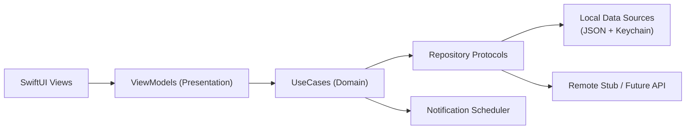
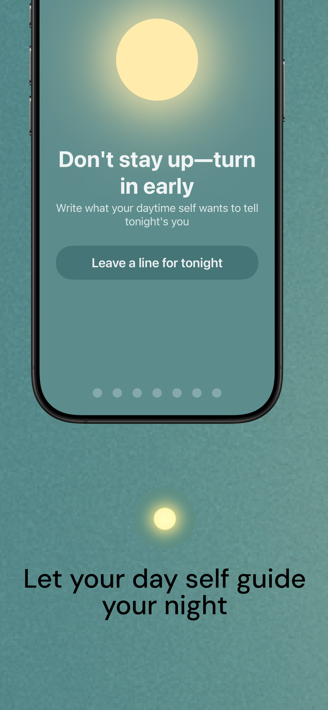
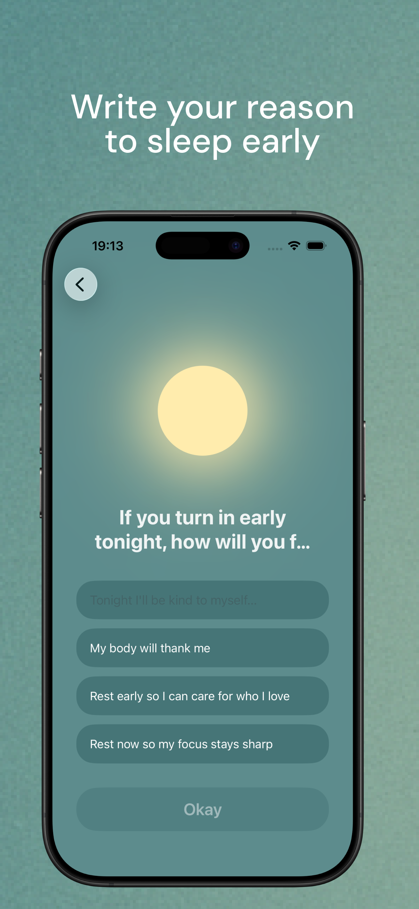
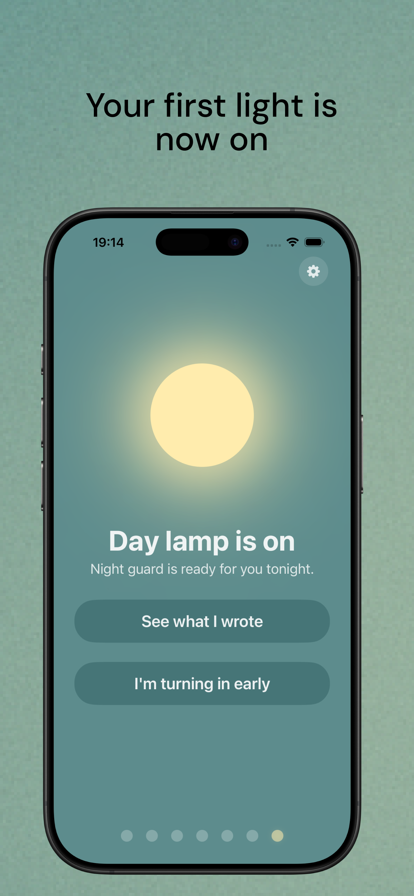
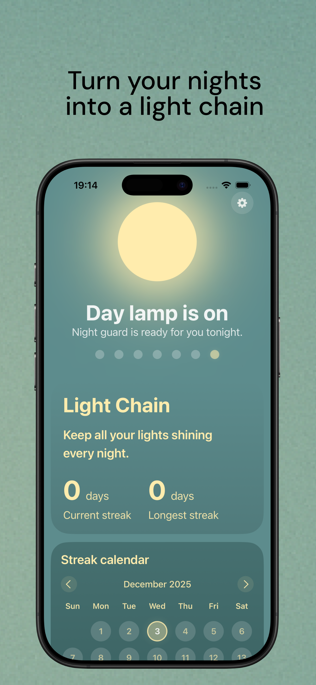

# Daylight

[中文 README](README.md)

> ✅ DayLight is already live on the App Store (search `DayLight`)  
> 🌐 Official website: [day-light-langding-page.vercel.app](https://day-light-langding-page.vercel.app)

Always say “I’ll sleep early tonight” and somehow it’s 2 a.m. again?  
DayLight turns one tiny daily ritual into a gentle guardrail against late-night scrolling.

## How it works

### Daytime: write one promise to your future self

Once a day, DayLight asks:

> If you don’t stay up late tonight, what do you gain?

Write your own reason or pick from smart suggestions.  
Tap confirm to light the first lamp — a commitment from day-you to night-you.

### Nighttime: get a soft reminder at the decision moment

Near your chosen bedtime, DayLight brings back that daytime message:

> Day-you left this for you: ...

Put your phone down and light the second lamp.  
Or keep scrolling — the lamp fades with a small sense of “what a pity,” not guilt.

### Light chain: build consistency with kindness

Two lamps a day become one chain of light.  
Miss a day? No punishment. Just start again tomorrow.

### No shame, no data overload

- No complex dashboards or fear-driven charts
- No “you failed X days in a row” pressure
- Minimal interaction focused on behavior change

## Who DayLight is for

- You keep scrolling at night and lose track of time
- You wake up tired and regret another late night
- You don’t want a full life overhaul, just earlier sleep more often

DayLight is a practical starting point:  
one promise, two lamps, a kinder path out of late nights.

## What I owned

- Product definition: behavior model, MVP scope, interaction rhythm.
- Client implementation: `SwiftUI + MVVM + UseCase + Repository`.
- Engineering setup: local data migration, notification scheduling, tests, and quality checks.
- Documentation and delivery: architecture docs, feature specs, design system, iteration shipping.

## Quick start

### Requirements

- Xcode 16+
- iOS Simulator
- SwiftLint (`brew install swiftlint`)

### Run app

```bash
git clone https://github.com/xiaosen3333/Daylight.git
cd Daylight
open Daylight.xcodeproj
```

Run `Daylight` scheme in Xcode.

### Run quality checks

```bash
make lint
make test
```

## Architecture



See [docs/Daylight-architecture-swift.md](docs/Daylight-architecture-swift.md) for details.

## English marketing screenshots

| 1 | 2 | 3 | 4 | 5 |
|---|---|---|---|---|
|  |  |  |  |  |

## Engineering signals in this repo

- Clear layered boundaries (`Presentation / Domain / Data / Core`)
- Repeatable command entry points (`Makefile`)
- Static checks + unit-test quality gates (local execution)
- End-to-end product-to-delivery execution

## Repository structure

```text
Daylight/
├── Daylight/                 # App source
│   ├── App/
│   ├── Presentation/
│   ├── Domain/
│   ├── Data/
│   ├── Core/
│   └── DesignSystem/
├── DaylightTests/            # Unit tests
├── docs/                     # Product/architecture/design docs
├── Makefile
└── README.md
```

## More docs

- [Engineering handbook](docs/engineering-handbook.md)
- [Feature spec](docs/feature-spec-daylight-core.md)
- [Design system](docs/design-system.md)
