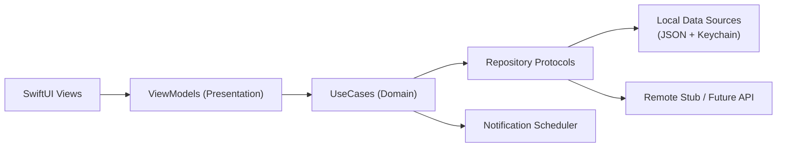

# Daylight

[](https://github.com/xiaosen3333/Daylight/actions/workflows/ios-ci.yml)

[中文 README](README.md)

Daylight is an iOS habit-building product that I designed and built end-to-end.  
This repository is used to showcase my mobile engineering ability: product modeling, architecture, testability, quality gates, and delivery discipline.

## What this project does

- Provides three core experiences: `Today Light / Night Guard / Light Chain`.
- Runs in local-first mode: offline-capable with pending sync replay.
- Uses an extensible layered architecture for future backend and subscription integration.

## What I owned

- Product definition: user flow, MVP scope, iteration planning.
- Client implementation: `SwiftUI + MVVM + UseCase + Repository`.
- Engineering setup: local data migration, notification scheduling, tests, lint, CI.
- Documentation system: architecture docs, feature specs, design system, engineering handbook.

## Quick start

### Requirements

- Xcode 16+
- iOS Simulator
- SwiftLint (`brew install swiftlint`)

### Run app

```bash
git clone https://github.com/xiaosen3333/Daylight.git
cd Daylight
open Daylight.xcodeproj
```

Run `Daylight` scheme in Xcode.

### Run quality checks

```bash
make lint
make test
```

## Architecture



See details in [docs/Daylight-architecture-swift.md](docs/Daylight-architecture-swift.md).

## English Marketing Screenshots

| 1 | 2 | 3 | 4 | 5 |
|---|---|---|---|---|
|  |  |  |  |  |

## Engineering habits shown in this repo

- Clear layered boundaries (`Presentation / Domain / Data / Core`).
- Repeatable command entry points (`Makefile`).
- Static checks + unit tests + GitHub Actions quality gates.
- Standardized commit convention (see `CONTRIBUTING.md`).

## Repository structure

```text
Daylight/
├── Daylight/                 # App source
│   ├── App/
│   ├── Presentation/
│   ├── Domain/
│   ├── Data/
│   ├── Core/
│   └── DesignSystem/
├── DaylightTests/            # Unit tests
├── docs/                     # Product/architecture/design docs
├── .github/workflows/        # CI pipelines
├── Makefile
└── CONTRIBUTING.md
```

## CI

GitHub Actions workflow: `.github/workflows/ios-ci.yml`

- SwiftLint strict mode
- iOS Simulator build + test (`xcodebuild test`)

## More docs

- [Engineering handbook](docs/engineering-handbook.md)
- [Feature spec](docs/feature-spec-daylight-core.md)
- [Design system](docs/design-system.md)
