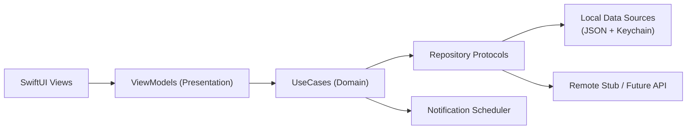
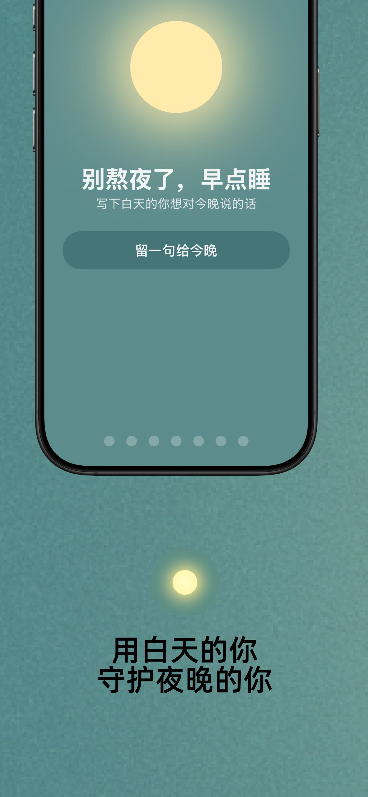
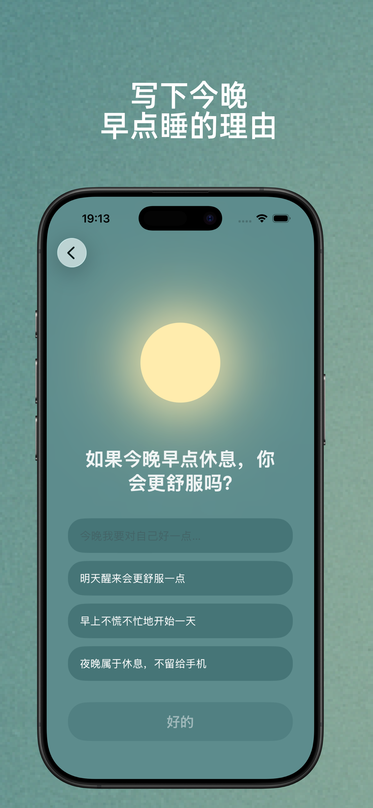
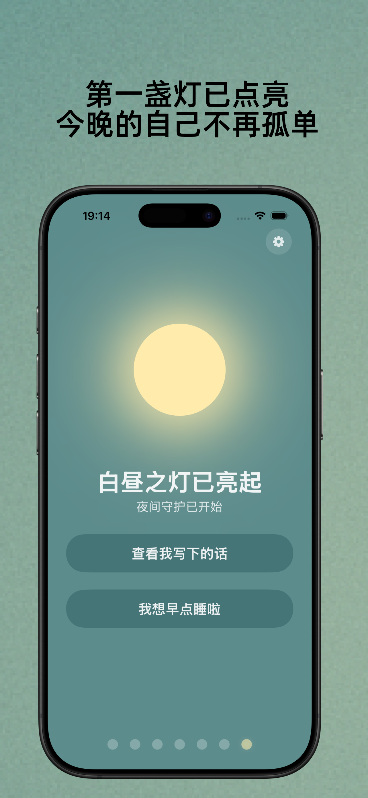
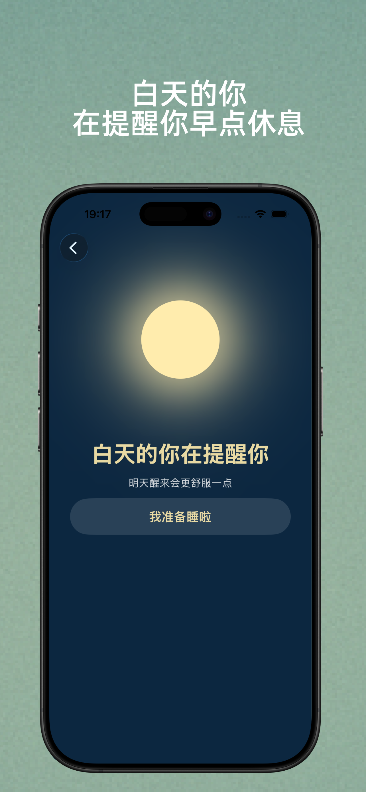
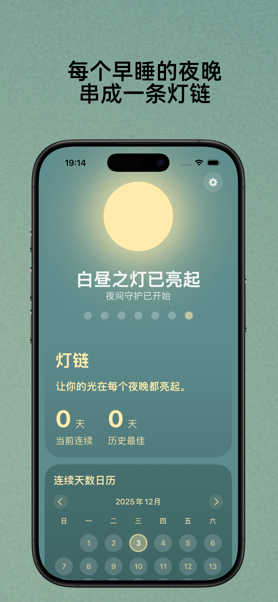

# Daylight

[English README](README.en.md)

> ✅ DayLight 已上架 App Store（可在商店搜索 `DayLight`）  
> 🌐 官网：[day-light-langding-page.vercel.app](https://day-light-langding-page.vercel.app)

总说今晚早点睡，却一刷就到两点？  
DayLight 用每天「两盏灯」这个极简仪式，让白天的你守护夜晚的你，帮助你戒掉报复性熬夜。

## 产品是怎么工作的

### 白天：写下一句给自己的承诺

每天白天，DayLight 会轻轻问你：

> 今晚如果不熬夜，你会得到什么？

你可以自己写一句，也可以从智能推荐中选择。  
点击确认，点亮第一盏灯。这是白天的你留给夜晚自己的提醒。

### 夜晚：在关键时刻收到温柔提醒

接近你设定的睡觉时间，DayLight 会弹出白天那句承诺：

> 白天的你留了这样一句话给你：...

你可以放下手机，点亮第二盏灯，完成今天的「两灯闭环」。  
如果你还是想再刷一会儿，灯会悄悄熄灭，只留下“可惜”，而不是“内疚”。

### 灯链：把坚持变成一串温暖的光

每天点亮两盏灯，就会连成一条灯链。  
断了也没关系，明天继续点亮就好。

### 不焦虑、不惩罚

- 没有复杂图表和红色警告
- 不用盯着“只睡了几小时”自责
- 用最小干预帮助行为改变

## DayLight 适合谁

- 晚上刷手机停不下来，常常“再看五分钟”就过点
- 白天精神状态差，后悔又熬夜
- 不想重做整套作息系统，只想先早点睡一点

DayLight 想给你的不是完美作息表，而是一个真正可持续的起点：  
从今天开始，让白天的你，守护夜晚的你。

## 我负责了什么

- 产品定义：核心行为模型、MVP 范围、交互节奏。
- 客户端实现：`SwiftUI + MVVM + UseCase + Repository`。
- 工程建设：本地存储迁移、通知调度、测试与质量检查流程。
- 文档与交付：架构文档、规格文档、设计系统、版本迭代。

## 快速开始

### 环境要求

- Xcode 16+
- iOS Simulator
- SwiftLint (`brew install swiftlint`)

### 运行 App

```bash
git clone https://github.com/xiaosen3333/Daylight.git
cd Daylight
open Daylight.xcodeproj
```

在 Xcode 中运行 `Daylight` scheme。

### 运行质量检查

```bash
make lint
make test
```

## 架构图



详细说明见：[docs/Daylight-architecture-swift.md](docs/Daylight-architecture-swift.md)

## 中文宣传图

| 1 | 2 | 3 | 4 | 5 |
|---|---|---|---|---|
|  |  |  |  |  |

## 这个仓库体现的工程能力

- 清晰分层与职责边界（`Presentation / Domain / Data / Core`）
- 可重复执行命令（`Makefile`）
- 静态检查 + 单测质量门禁（本地执行）
- 从产品想法到可交付 App 的完整落地能力

## 仓库结构

```text
Daylight/
├── Daylight/                 # App source
│   ├── App/
│   ├── Presentation/
│   ├── Domain/
│   ├── Data/
│   ├── Core/
│   └── DesignSystem/
├── DaylightTests/            # Unit tests
├── docs/                     # Product/architecture/design docs
├── Makefile
└── README.en.md
```

## 更多文档

- [工程手册](docs/engineering-handbook.md)
- [功能规格](docs/feature-spec-daylight-core.md)
- [设计系统](docs/design-system.md)
