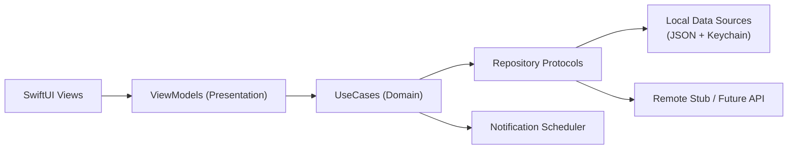

# Daylight

[](https://github.com/xiaosen3333/Daylight/actions/workflows/ios-ci.yml)

[English README](README.en.md)

Daylight 是我独立设计和实现的 iOS 行为养成产品，目标是帮助用户降低熬夜频率。  
这个仓库用于展示我的移动端工程能力：产品抽象、架构设计、可测试性、质量门禁、交付规范。

## 这个项目做什么

- 提供 `今日之灯 / 夜间守护 / 灯链` 三条核心体验。
- 以本地优先模式运行：离线可用，支持待同步队列回放。
- 使用可扩展分层架构，兼容后续接入真实后端与会员能力。

## 我负责了什么

- 产品定义：功能流程、MVP 范围、迭代节奏。
- 客户端实现：`SwiftUI + MVVM + UseCase + Repository`。
- 工程建设：本地存储迁移、通知调度、测试、Lint、CI。
- 文档体系：架构文档、规格文档、设计系统、工程手册。

## 快速开始

### 环境要求

- Xcode 16+
- iOS Simulator
- SwiftLint (`brew install swiftlint`)

### 运行 App

```bash
git clone https://github.com/xiaosen3333/Daylight.git
cd Daylight
open Daylight.xcodeproj
```

在 Xcode 中直接运行 `Daylight` scheme。

### 运行质量检查

```bash
make lint
make test
```

## 架构图



详细说明见：[docs/Daylight-architecture-swift.md](docs/Daylight-architecture-swift.md)

## 中文宣传图

| 1 | 2 | 3 | 4 | 5 |
|---|---|---|---|---|
|  |  |  |  |  |

## 这个仓库体现的工程习惯

- 明确分层目录与职责边界（`Presentation / Domain / Data / Core`）。
- 可重复执行的命令入口（`Makefile`）。
- 静态检查 + 单测 + GitHub Actions 质量门禁。
- 统一提交风格（Conventional Commits，见 `CONTRIBUTING.md`）。

## 仓库结构

```text
Daylight/
├── Daylight/                 # App source
│   ├── App/
│   ├── Presentation/
│   ├── Domain/
│   ├── Data/
│   ├── Core/
│   └── DesignSystem/
├── DaylightTests/            # Unit tests
├── docs/                     # Product/architecture/design docs
├── .github/workflows/        # CI pipelines
├── Makefile
└── CONTRIBUTING.md
```

## CI

GitHub Actions workflow: `.github/workflows/ios-ci.yml`

- SwiftLint 严格模式
- iOS Simulator build + test (`xcodebuild test`)

## 更多文档

- [工程手册](docs/engineering-handbook.md)
- [功能规格](docs/feature-spec-daylight-core.md)
- [设计系统](docs/design-system.md)
