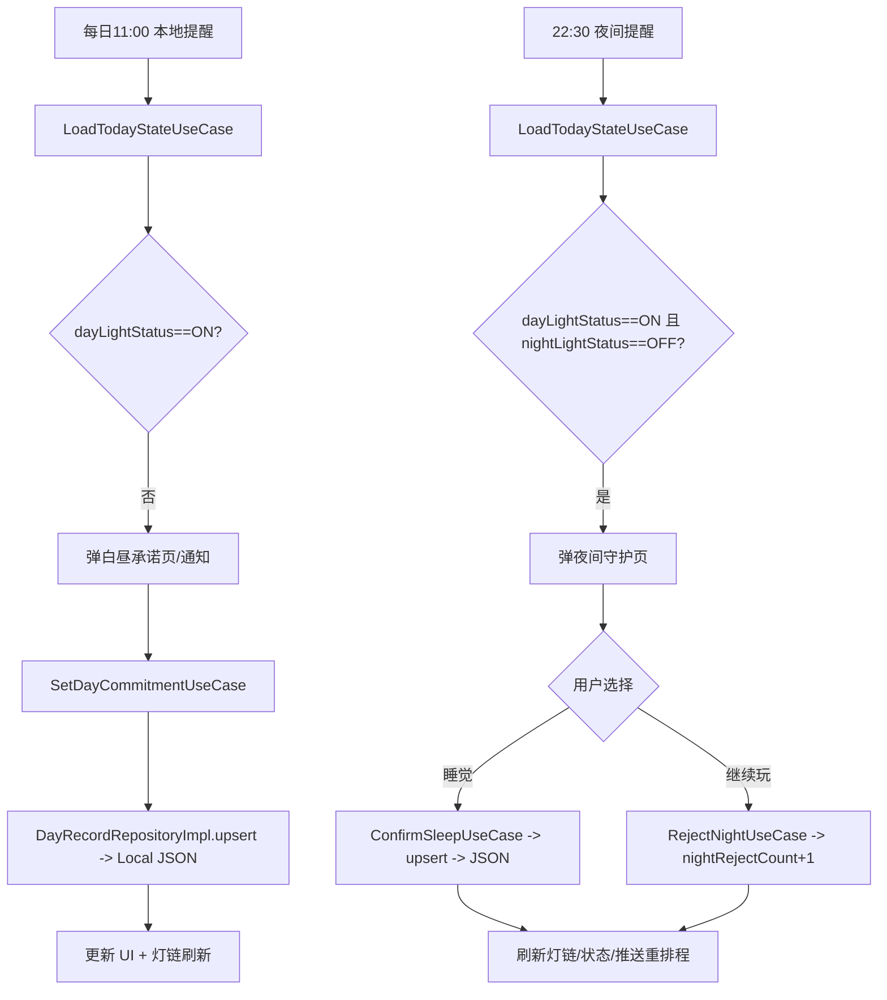

# Daylight PRD（MVP 存档）

## 新版本更新（1.4.15）
- 目的：统一日历单元模型/色板与日期展示，复用共享组件避免重复定义；版本号 1.4.15。
- 范围：Presentation/Components/Calendar 新增 DayVisualStatus/dayStatus(for:)/DayVisualStyle(Palette)/DayCell；TodayView、LightChainPage、LightChainVisualizationComponents 改用共享 DayCell/Palette，并使用 DaylightDateHelper.formattedDay 输出日期；月视图补位/选中/打灯逻辑保持。
- 影响面：main/streak palette 复刻原色值与阴影（main overlay12、partial glow 6/complete 12、off 文案保持金色 65%；streak overlay15、partial 背景 35%+glow 6、complete glow 10、off 文案 65%）；业务接口、UseCase 不变。
- 验收要点：跨月补 nil、firstWeekday 顺序不变，nil 记为 off；日夜全亮 complete、日亮夜灭 partial；LightChainStreakCalendar 选中描边 2pt+现有 glow 维持；DayRecordStatusCard/详情日期经 formattedDay 尊重 locale+timeZone；`xcodebuild -project Daylight.xcodeproj -scheme Daylight -destination 'generic/platform=iOS Simulator' build` 通过。

### ASCII 原型（共享 DayCell 渲染）
```
[Shared DayCell 渲染]
  dayStatus -> palette -> (bg,text,glow,radius)
  [off]     ○ 12   overlay bg, muted gold text, no glow
  [partial] ● 12   gold 40%, white text, small glow
  [complete]● 12   solid gold, on-glow text, strong glow
  选中态（需要时）: 外圈描边 keep 2pt
```

### ASCII 原型（LightChainPage）
```
+------------------------------------------------+
| Sun Card      | Calendar Card (DayCell palette: main) |
| Detail Card   | Streak Card                     |
| 下方 DayRecordStatusCard 使用 formattedDay      |
+------------------------------------------------+
```

### ASCII 原型（TodayView stats 折叠区）
```
LightChainVisualizationGallery
  - Primary Card
  - Streak Calendar Card (DayCell palette: streak)
  - DayRecordStatusCard(formattedDay)
```

### ASCII 原型（LightChainVisualizationComponents.LightChainStreakCalendarCard）
```
<月切换>  weekdayHeader
[DayCell grid 7xN，空位 nil]
选中态描边 + glow 维持原样（palette: streak）
```

### ASCII 原型（DayRecordStatusCard）
```
日期 (formattedDay)
状态标题/描述
承诺/睡眠/拒绝文案（逻辑不变）
```

### 技术架构与要点更新
- Presentation/Components/Calendar 新增 DayVisualStatus + DayVisualStylePalette(main/streak) 与 DayCell(Identifiable & Hashable)；dayStatus(for:) 统一判定 nil/off/partial/complete。
- DaylightDateHelper 增加 formattedDay(dateString:locale:dateStyle:timeZone:) 以 dayFormatter 解析 yyyy-MM-dd，locale/timeZone 透传，失败回原串。
- LightChainStreakCalendarCard/TodayView/LightChainPage 日历渲染改用共享 DayCell + palette（main/streak），选中态 stroke 2pt + glow 数值保持，monthGrid 补位/firstWeekday 逻辑不变。
- DayRecordStatusCard 与详情卡日期展示切换至 formattedDay，睡眠时间仍用 dateHelper.displayTimeString，默认占位/打灯判定/选中态保持原流程。
- 版本号 MARKETING_VERSION 更新至 1.4.15，未引入新依赖，DesignSystem 组件继续沿用现有颜色/尺寸。

## 新版本更新（1.4.14）
- 目的：首页灯带按本地周序列（尊重 locale 首日、时区与夜窗归一化）固定 7 盏，今天落在对应位置；版本号 1.4.14。
- 范围：TodayViewModel 新增 currentWeekDayKeys/weekLightChain 基于 todayKey（夜窗）+ calendar.firstWeekday 生成 7 个 dayKey，lightChain 14 天与 state.record 组 Map，缺失用 defaultRecord 填充；TodayView.lightChainBar 直接渲染 weekLightChain（无 suffix/padding），点击展开统计逻辑保持；LoadLightChain 拉取周期不变。
- 影响面：仅首页底部灯带顺序与数量更新，Stats 展开/LightChain 可视化/通知/后端接口均不变，DesignSystem 仍用 LightDot。
- 验收要点：周日/周一起始 locale 下今天均落在对应序位；跨月周显示正确；夜窗凌晨归前一日仍按周序；灯数恒 7 且缺失为灭灯；点击灯带可正常展开/收起统计；`xcodebuild -project Daylight.xcodeproj -scheme Daylight -destination 'generic/platform=iOS Simulator' build` 通过。

### ASCII 原型（首页底部灯带，随 locale 首日变化）
```
[Mon][Tue][Wed][Thu][Fri][Sat][Sun]
  o    o    O    .    .    .    .
```
```
[Sun][Mon][Tue][Wed][Thu][Fri][Sat]
  .    o    o    O    .    .    .
```

### 技术架构与要点更新
- TodayViewModel：currentWeekDayKeys 使用 todayKey(for:) 结合 dateHelper.calendar/timeZone 与 calendar.firstWeekday 计算本周起点并生成 7 个 dayKey；weekLightChain 以 lightChain 为基础由 state.record 覆盖同日，按周序回填 defaultRecord（userId 为空用空字符串），保证返回长度 7。
- TodayView：lightChainBar 直接消费 weekLightChain 渲染 7 盏 LightDot，无额外补位，点击行为/动画保持不变。
- 数据/接口：LoadLightChain 仍请求近 14 天，record(for:) 与 monthRecords 逻辑不动；设计系统与其他页面未新增组件或改样式。

## 新版本更新（1.4.13）
- 目的：当前 streak 起算规则允许今日缺失时从昨日起跳，但昨天缺失直接归零，保持 longest 不变；版本号 1.4.13。
- 范围：GetStreakUseCase.computeCurrent 调整起点/累加规则并复用现有 dayKeys（夜窗 todayKey 在首位）与 recordMap；新增 isComplete 双灯判定；新增 GetStreakUseCase 单测覆盖今日/昨日全亮或缺失四场景；MARKETING_VERSION 同步。
- 影响面：LightChainPrimaryCard、LightChainPage 底部 streak 卡、LightChainVisualizationGallery 仅数据更新，组件与样式保持现状。
- 验收要点：今日双灯全亮→从今天累加；今日缺失→跳过今天从昨天起算，若昨天缺记录/缺灯则 current=0；向前遇缺口/缺灯/缺记录即停；longest 仍 max(current, computeLongest)；`xcodebuild -project Daylight.xcodeproj -scheme Daylight -destination 'generic/platform=iOS Simulator' build` 通过。

### ASCII 原型（LightChain 显示）
```
[LightChainPrimaryCard]
+------------------------------------------------------+
| Light Chain 标题                                     |
| 副标题                                               |
| 当前 2 天        最长 14 天                          |
+------------------------------------------------------+

[LightChainPage 底部 streak 卡]
+---------------- 你的坚持天数 -------------------------+
| 2 天坚持 · 14 天最佳                                  |
| [|||] 当前:2     [|||] 最长:14                       |
+------------------------------------------------------+
```

### 技术架构与要点更新
- GetStreakUseCase：新增 isComplete(record) 复用双灯全亮判定；computeCurrent 先看 todayKey 是否全亮，全亮从 index 0 累加，否则从 index 1（昨日）开始，起点缺失直接 0，向前遇缺口/缺灯即停；computeLongest 与 longest 计算保持原样。
- 数据流：沿用 NightWindow 生成 dayKeys 与 recordMap（无新增存储/UI 组件），LightChain 相关视图自动读取最新 current 值。
- 测试：DaylightTests/GetStreakUseCaseTests 覆盖今日/昨日全亮、今日缺失但昨日全亮、昨日缺灯/缺记录归零等四场景，保证 current 起点与停顿规则符合预期。
- 版本：MARKETING_VERSION 更新至 1.4.13；其他模块逻辑与 DesignSystem 不受影响。

## 新版本更新（1.4.12）
- 目的：日间承诺推荐理由升级为 3 槽原地补位，基于 8 条本地文案池避免重复与空槽；版本号 1.4.12。
- 范围：DayCommitmentPage TextField 绑定 viewModel.commitmentText，推荐区改为 ForEach 三槽胶囊按钮（plain）；TodayViewModel 新增 allSuggestions(8)、suggestionsVisible/usedSuggestionIds 状态与 setupSuggestions/pickSuggestion/onTextChanged/refillSlot 补位逻辑；提交按钮 1–80 字启用，复用 submitCommitment；MARKETING_VERSION 同步。
- 影响面：仅日间承诺页 UI/交互与本地化文案新增；首页、NightGuard、Settings 等其他模块逻辑与样式不变，Design tokens/通知/UseCase 未改。
- 验收要点：进入页面随机 3 条且不等于当前输入、互不重复；点击槽 2 -> commitmentText 更新，槽 2 立刻换新且槽 1/3 不动，多次点击同槽持续换新直至池耗尽再回收；手动输入等于某槽文案会清空该槽并按规则补满；按钮仅在 1–80 字启用，提交成功后返回；`xcodebuild -project Daylight.xcodeproj -scheme Daylight -destination 'generic/platform=iOS Simulator' build` 通过。

### ASCII 原型（日间承诺 3 槽原地补位）
```
背景: DaylightColors.bgPrimary
[GlowingSun 120]
[标题 commit.title.full]

[胶囊 TextField 占位 commit.placeholder.short 绑定 commitmentText]
[槽1: 推荐A]  (plain 胶囊按钮)
[槽2: 推荐B]  (点击 -> commitmentText=文案, 槽2原地换新)
[槽3: 推荐C]  (槽为空时显示空胶囊占位)

[DaylightPrimaryButton "common.confirm" 1–80 字启用]
```

### 技术架构与要点更新
- TodayViewModel：新增 allSuggestions（本地化 8 条）、suggestionsVisible[3]、usedSuggestionIds；setupSuggestions 基于当前输入随机填充三槽且跳过相同文案，refillSlot 仅替换指定槽并优先未用文案，不足时回收已用仍避免当前输入/重复，onTextChanged 命中槽文案时清空并补位。
- DayCommitmentPage：TextField 双向绑定 commitmentText，onChange 限制 80 字并驱动 onTextChanged；推荐区 ForEach 渲染三槽胶囊 Button plain 样式，空槽用半透明胶囊占位；点击槽调用 pickSuggestion，提交按钮 isEnabled 取决于 1–80 字并复用 submitCommitment 流程。
- 本地化：新增 commit.suggestion4...8（中英）；DesignSystem 组件沿用 DaylightPrimaryButton / DaylightColors.actionPrimary / DaylightRadius.capsule，无新增样式。
- 版本：MARKETING_VERSION 更新至 1.4.12，仅该版本号变更，其他模块未调整。

## 新版本更新（1.4.11）
- 目的：统一 Day/Night CTA 样式入口，避免组件串场，版本号 1.4.11。
- 范围：DesignSystem 新增 DaylightCTAButton(kind) 并为 Primary/Secondary/Ghost 提供兼容别名；Today 首页夜间 CTA（early/inWindow/expired）与 wake 按钮统一 dayPrimary；NightGuard 所有阶段 CTA（含 adjust）统一 nightPrimary 并补齐 loading；Design tokens 不变。
- 影响面：仅 UI 组件替换与按背景选择 kind，业务逻辑、UseCase、路由不动；旧调用保持原签名与默认参数。
- 验收要点：Today 任意夜间 CTA、wake、日间承诺按钮均为 dayPrimary；NightGuard 所有状态按钮为 nightPrimary 且 early/inWindow 显示 loading；Settings 等幽灵按钮保持 ghost；`xcodebuild -project Daylight.xcodeproj -scheme Daylight -destination 'generic/platform=iOS Simulator' build` 通过。

### ASCII 原型（Today 首页 - 全 dayPrimary）
```
背景: DaylightColors.bgPrimary
[GlowingSun 140]
[Hero 标题]
[副标题]

[CTA: DaylightCTAButton(kind:.dayPrimary) homeButtonTitle]
[夜间 CTA: DaylightCTAButton(kind:.dayPrimary) 睡觉/提前睡/过期文案]
[可选: DaylightCTAButton(kind:.dayPrimary) "home.button.wake"]
[LightDot x7 灯链按钮]
[Stats 网格展开区]
```

### ASCII 原型（日间承诺页 - 全 dayPrimary）
```
背景: DaylightColors.bgPrimary
[GlowingSun 120]
[标题 commit.title.full]

[胶囊 TextField + 3 个 plain 胶囊建议按钮]
[CTA: DaylightCTAButton(kind:.dayPrimary) "common.confirm"]
```

### ASCII 原型（NightGuard - 全 nightPrimary）
```
背景: DaylightColors.bgNight
[GlowingMoon 120]
[标题: night.*.title]
[正文: early/inWindow 显示承诺或占位; notEligible 显示 night.subtitle.notReady]

CTA 组合 (kind:.nightPrimary):
- early:        [night.button.early  isLoading/isEnabled 复用现逻辑]
- inWindow:     [night.button] + [night.button.continue]
- expired/afterCutoff: [night.button.home] + [night.button.adjust]
- completed:    [night.button.home]
- notEligible:  [night.button.commit] + [night.button.home]
- beforeEarly:  [night.button.home]
```

### 技术架构与要点更新
- DesignSystem/Components 新增 `DaylightCTAButton(kind:isEnabled:isLoading:icon:action:)`，按 kind 分发 dayPrimary/nightPrimary/ghost 样式，沿用既有颜色/圆角/字号/padding。
- DaylightPrimaryButton / DaylightSecondaryButton / DaylightGhostButton 保留旧签名作为别名并标注推荐使用 CTA；Secondary/Ghost 新增 `isLoading`（默认 false）以便夜间 loading 时阻断点击。
- TodayView 夜间 CTA（含 expired）与 wake 按钮统一 dayPrimary，现有文案与导航逻辑保持不变。
- NightGuardPage 所有按钮改为 nightPrimary（含原 ghost adjust），保持 isSavingNight 绑定与 dismiss/导航流程不动。
- MARKETING_VERSION 同步更新为 1.4.11；Design tokens 未调整，其他模块视觉与逻辑等价。

## 新版本更新（1.4.10）
- 目的：夜间守护不可用态直达承诺页，减少回首页再跳转的多余操作；版本号 1.4.10。
- 范围：NightGuard `.notEligible` 新增主 CTA “去写承诺” 使用 DaylightPrimaryButton，点击后先关闭夜页再经 `.daylightNavigate` deeplink=day 跳转 DayCommitmentPage；`.beforeEarly` 仍仅保留“回首页”；TodayViewModel 增加 `navigateToDayPage` 复用既有通知导航；本地化新增 `night.button.commit` / `night.subtitle.notReady`。
- 影响面：仅 NightGuard 不可用态的按钮与文案调整，其余阶段（early/inWindow/expired/afterCutoff/beforeEarly）按钮与逻辑保持不变；导航与 DesignSystem 组件沿用现有实现，无新增样式。
- 验收要点：夜间通知进入 notEligible 场景→点击“去写承诺”关闭夜页并打开 DayCommitmentPage；其他阶段按钮组合不变；中文/英文文案正确落地；`xcodebuild -project Daylight.xcodeproj -scheme Daylight -destination 'generic/platform=iOS Simulator' build` 通过。

### ASCII 原型（NightGuard - notEligible）
```
+----------------------------------------------------+
| 夜空背景                                           |
|             ☆   🌙（现有插画保持不变）             |
|  标题：先点亮白昼之灯                               |
|                                                    |
| [ 去写承诺 ]  (Primary 金色按钮)                    |
| [ 回首页  ]  (Secondary 按钮，保留现有)             |
+----------------------------------------------------+
```

### ASCII 原型（DayCommitment 跳转后）
```
+-----------------------------------------------+
| 太阳插画                                      |
| 如果今晚早点休息，你会更舒服吗？               |
| [文本输入胶囊]                                 |
| [建议1] [建议2] [建议3]                        |
| [好的]                                        |
+-----------------------------------------------+
```

### 技术架构与要点更新
- NightGuardPage 将 `.notEligible` 与 `.beforeEarly` 拆分，前者新增 DaylightPrimaryButton “去写承诺”（dismiss 后调用 `navigateToDayPage`），保留 DaylightSecondaryButton “回首页”；正文在不可用态展示 `night.subtitle.notReady` 引导补写承诺，按钮间距沿用 12pt。
- TodayViewModel 新增 `navigateToDayPage(dayKey:)`，与夜页/设置页导航同样通过 `NotificationCenter.default.post(name: .daylightNavigate, userInfo:)` 发送 `deeplink: "day"`，避免重复造轮子。
- 本地化补充 `night.button.commit` / `night.subtitle.notReady`，MARKETING_VERSION 更新为 1.4.10；使用既有 DaylightPrimaryButton/DaylightSecondaryButton 与 `.daylight` 文本样式，未新增组件或样式。

## 新版本更新（1.4.9）
- 目的：夜间入口与 NightGuard 去掉承诺预览与提示文案，保留按钮节奏，避免多余提示；版本号 1.4.9。
- 范围：Today 夜间 CTA 卡片仅保留主按钮（早睡/睡觉/过期态 Primary/Secondary）；NightGuard 移除跨日提示与 secondary hint，正文仅早睡/夜窗显示承诺或占位；本地化删除对应 hint key；工程版本号同步。
- 影响面：首页夜间卡片仅剩主 CTA，不再露出承诺预览或 hint；NightGuard 完成/过期/不可用状态正文为空无额外空行，按钮组合与现有组件保持一致；其他模块不改。
- 验收要点：早睡/夜窗态主按钮可正常进入夜间页；过期态按钮为 Secondary，卡片无其他文案；NightGuard 仅 `.early/.inWindow` 出现正文，其他阶段正文隐藏无空白；`home.cta.early/expired.hint` 与 `night.hint.*` 均无引用；xcodebuild 通过。

### ASCII 原型（Today 夜间 CTA 卡片）
```
[Hero Title]
[Subtitle]

[Primary/Secondary CTA 按钮]   ← 根据阶段早睡/睡觉/过期
[Wake 按钮] (可选，已有逻辑)
```

### ASCII 原型（NightGuard）
```
NightGuard（early / inWindow）
[Star & Moon 图]

[标题: night.title]
[承诺正文或占位文案]

[主按钮: 提前睡 / 去睡觉]
[次按钮: 继续忙一下] (仅 inWindow)

NightGuard（completed / expired / afterCutoff / notEligible / beforeEarly）
[Star & Moon 图]

[标题: 对应 state title]
[无额外提示文案]

[次按钮/幽灵按钮组合: 回首页 / 调整设置（过期态）]
```

### 技术架构与要点更新
- TodayView.nightCTAConfig 去掉 hint 字段，夜间 CTA 仅渲染主按钮并按 phase 切换 Primary/Secondary，移除承诺预览函数。
- NightGuardPage 移除 dayKey 顶部提示与 secondary hint，`bodyText` 仅在 `.early/.inWindow` 返回承诺/占位，其余为 nil，通过 `if let` 控制正文显隐，spacing 适度收紧。
- 本地化清理 `home.cta.early/expired.hint` 与 `night.hint.*` 文案，MARKETING_VERSION 更新为 1.4.9；沿用现有 DesignSystem 按钮与 `.daylight` 文本样式，无新增组件。

## 新版本更新（1.4.8）
- 目的：当前连续天数按“从今日（夜窗切日）向前逐日，遇到缺口/未完成即停”，不再跳过缺口；版本号 1.4.8。
- 范围：GetStreakUseCase 当前 streak 计算、DaylightDateHelper 日期序列工具、TodayViewModel 调用签名、LightChainPrimaryCard 数据源；Longest 逻辑与 DesignSystem/UI 组件保持不变。
- 影响面：current streak 必须从今天起连续且日/夜两灯全亮才能累计；todayKey 取本地夜窗；lightchain 主卡直接展示新 current 值；LoadLightChain 复用日期序列生成避免重复逻辑；历史最佳仍基于既有记录遍历。
- 验收要点：今天缺记录或任一日缺灯 -> current=0；无缺口连续 5 天全亮 -> current=5；[T-2 完成, T-1 缺失, T0 完成] -> current=0；夜窗跨日 todayKey 仍正确；xcodebuild 通过。

### ASCII 原型（主卡片不变，仅数值更新）
```
+--------------------------------------------------+
| Lightchain (glowGold)                            |
| 今天起连续天数： [  2 天 ]   历史最佳： [ 14 天 ] |
| (其余灯链可视化保持不变)                           |
+--------------------------------------------------+
```

### ASCII 原型（当前连击计算流程）
```
todayKey = dateHelper.localDayString(now, NightWindow(settings))
dayKeys = [T0, T-1, T-2, ...]  // 连续按天生成

for key in dayKeys:
  record = recordMap[key]
  if record is nil -> stop (current = streak)
  if record.dayLightStatus != .on or record.nightLightStatus != .on -> stop
  streak += 1
return streak
```

### 技术架构与要点更新
- DaylightDateHelper：新增 `recentDayKeys(days:reference:nightWindow:)`，按夜窗切日生成最近天 key，复用原有 localDayString/dayFormatter。
- GetStreakUseCase：`execute(userId:settings:)` 以夜窗生成 dayKeys，从今天向前查 recordMap，遇缺口或任一灯未亮立即终止；longest 保持原样，仍用 `max(current, computeLongest(records:))`。
- LoadLightChainUseCase：改用 `recentDayKeys` 生成日期范围，避免重复日期计算，填充占位/排序逻辑不变。
- TodayViewModel：`refreshStreak` 传入已加载的 state.settings 调用新签名；UI 组件沿用 DesignSystem，无新增样式。

## 新版本更新（1.4.7）
- 目的：系统时间/时区/区域变更后自动刷新 dayKey、夜窗与提醒排程，12/24h 文案自适应，检测大幅跳变时阻断关键入口；版本号 1.4.7。
- 范围：Core 时间工具、通知调度、AppContainer 中枢监听、TodayViewModel 刷新与入口保护；UI/DesignSystem 不新增组件。
- 影响面：DateHelper/NotificationScheduler 改用 `Calendar/TimeZone.autoupdatingCurrent`；TimeChangeMonitor 监听 tz/locale/significantTimeChange + uptime delta>5min；AppContainer 转发事件重建时间依赖并刷新 VM；大幅跳变时提交承诺/入睡/撤销入口用现有错误提示中断；其他模块保持原样。
- 验收要点：切换时区后 dayKey/nightTimeline/提醒按新时区重算且 UI 时间文案随 12/24h 更新；系统时间拨动>5min 时入口被拦截并提示，完成全量刷新与通知重排；pending 通知与 lastScheduledDayKey 按新日界线更新；xcodebuild 通过。

### ASCII 原型（时间变更事件流）
```
+-----------------------------+    +---------------------+    +-----------------------------+
| 系统变更 (tz/locale/跳变)   | -> | TimeChangeMonitor   | -> | AppContainer.handleTimeChange |
| + uptime 差值校验           |    | 监听+delta>5min     |    | 重建时间源/调度并转发给 VM    |
+-----------------------------+    +---------------------+    +-------------+---------------+
                                                                          |
                                                                          v
                                                        +-----------------------------+
                                                        | TodayViewModel.handleTime...|
                                                        | refreshAll -> reschedule    |
                                                        | -> scheduleDayChangeCheck   |
                                                        +-----------------------------+
                                                                          |
                                                                          v
                                              dayKey/nightTimeline/通知按新 tz/locale/制式重算
```

### 技术架构与要点更新
- DateHelper：默认使用 autoupdating Calendar/TimeZone，提供 `withCurrentEnvironment()` 便捷创建，formatter/calendar 统一复用。
- NotificationScheduler：同样改为 autoupdating 来源，新增 `handleTimeChange` 清理已存/待触发请求并重新排程，localized 使用 `Locale.autoupdatingCurrent`。
- TimeChangeMonitor：订阅 `NSSystemTimeZoneDidChange` / `UIApplication.significantTimeChangeNotification` / `NSLocale.currentLocaleDidChangeNotification`，对比 `Date()` 与 `systemUptime` 检测 delta>5 分钟触发 `.significantJump`。
- AppContainer：持有 monitor，事件回调中重建 dateHelper/notificationScheduler 并调用 `TodayViewModel.handleTimeChange(event:)`，保持网络监听/同步逻辑不变。
- TodayViewModel：处理时间变更时调用 `refreshAll(trigger:.manual, includeMonth:true)` -> 调度重排 -> `scheduleDayChangeCheck()`，locale 同步 `LanguageManager`；对大幅跳变事件在提交承诺/入睡/撤销入口直接走现有错误提示短路，避免错误打灯；视图层无新增组件。
- 非相关模块保持不变：Night/Settings/DesignSystem 未改，通知 ID 规则沿用。

## 新版本更新（1.4.6）
- 目的：夜窗内调整夜窗开始/结束/间隔时立即按新窗口重排当晚剩余夜间提醒，不新增提示 UI；版本号 1.4.6。
- 范围：Settings 夜窗设置保存流程、Today VM 夜间排程、NotificationScheduler 入参；DesignSystem/UI 保持现状。
- 影响面：夜窗内/早睡期变更夜窗会立刻按新窗口重排仅剩余提醒（过滤 fireDate<=now）；夜窗外或夜间提醒关闭时沿用原排程；无 toast/弹窗新增。
- 验收要点：夜窗内调整开始/结束/间隔后 Pending 列表仅保留未来时间且 dayKey 以新夜窗切日；夜窗外调整仍按原逻辑排程；其他模块行为不变；xcodebuild 通过。

### ASCII 原型（设置页仅逻辑增强，无新增 UI）
```
[设置页 SettingsPage]  // 仅逻辑增强，无视觉改动
+-------------------------------------------------+
| 提醒设置                                         |
|  白昼提醒时间     [ 11:00 ▾ ]                    |
|  开启夜间提醒     [ ON  ]                       |
|  最早入睡时间     [ 22:30 ▾ ]                   |
|  最晚入睡时间     [ 00:30 ▾ ]                   |
|  夜间提醒间隔     [ 30 min ▾ ]                  |
|  显示我写的句子   [ ON ]                        |
|  (无新提示/Toast)                               |
+-------------------------------------------------+
```

### 技术架构与要点更新
- NotificationScheduler：`reschedule`/`scheduleDaily` 新增可选 `now` 入参，沿用 `fireDate > now` 过滤仅排未来提醒，复用 `nightReminderTimes`/`nightDateComponents`/`saveScheduled`，`lastScheduledDayKey` 写入当次 `dayKey`。
- TodayViewModel.saveSettings：保存前记录旧夜窗三元组，保存后基于新设置/`now` 计算 `nightTimeline`；夜窗变更且 `phase` ∈ {early, inWindow} 时 `forceRescheduleTonight(now)` 仅重排当晚（`dayKey` 取 `timeline.dayKey`，`shouldScheduleNight` 判定夜间需求，`nextDayKey=nil`），否则走 `scheduleNotifications()`。
- SettingsPage/DesignSystem：无新增组件或提示，继续用 `DebouncedSettingsSaver` 触发保存；夜窗外、夜间提醒关闭或无变更时不触发强制重排。
- 版本：`MARKETING_VERSION` 更新至 1.4.6，存储/接口契约不变。

## 新版本更新（1.4.5）
- 目的：夜间提醒开关仅控制是否排程推送，不再隐藏 Today 夜间 CTA；夜窗内关闭开关立即清除当晚提醒并提示用户；版本号 1.4.5。
- 范围：Today 首页夜灯 CTA 显示逻辑、Settings 夜间提醒开关交互与夜间通知清理、本地化文案、工程版本号；夜页/通知调度其他路径保持原样。
- 影响面：`nightReminderEnabled=false` 时夜窗/早睡/过窗前 CTA 仍可进入夜间守护；夜窗内从 ON→OFF 会立刻移除当晚夜间通知并弹提示；非夜窗或过 cutoff 关闭仅停止后续排程；重新开启沿用既有重排逻辑，其他设置项与页面不受影响。
- 验收要点：夜窗内夜灯 OFF 且日灯 ON 时，即使提醒关闭首页仍出现睡觉 CTA 并可进入夜间页；夜窗内关闭夜间提醒弹出“今晚不再提醒，可在设置重新开启”且系统 Pending 列表无夜间提醒 ID；非夜窗关闭无弹窗但后续不再排程；重新打开后夜间提醒恢复排程，xcodebuild 通过。

### ASCII 原型（夜间提醒开关不再隐藏入口）
```
[首页 Today]
日灯: ON   夜灯: OFF    夜间提醒: 已关闭
------------------------------------------------
| [ 我要睡觉 / 提前入睡 ]  (主按钮始终可见)       |
|  若过窗但未截止：副文案“今晚守护已结束”       |
------------------------------------------------
[设置 - 提醒]
日间提醒        [22:00]  (时间选择器)
夜间提醒开关    [ OFF ]
夜间开始        [22:30]  夜间结束 [00:30]
提醒间隔        [30 分 ▼]
------------------------------------------------
| 弹窗/Toast: 今晚不再提醒，可在设置重新开启     |
|             [知道了]                          |
------------------------------------------------
```

### 技术架构与要点更新
- Today：`nightCTAContext` 不再校验 `settings.nightReminderEnabled`，仅基于 `NightGuardContext.showHomeCTA/phase` 与 `nightPhase` 控制显隐，过 cutoff 才隐藏。
- Settings：夜间提醒 Toggle 拦截 ON→OFF 时调用 `handleNightToggle`；若 `dateHelper.nightTimeline` 判定处于 `.inWindow` 则立即 `NotificationScheduler.clearNightReminders()` 并弹出 `settings.night.disable.confirm` 提示，同时继续交给 `DebouncedSettingsSaver` 保存并触发 `saveSettings`→`updateSettingsUseCase`→`scheduleNotifications()`。
- 新增辅助方法：`TodayViewModel.handleNightToggle(enabled:now:)` 复用 `nightTimeline` 判窗，夜窗内清理夜间提醒，避免重复造轮子。
- 本地化/版本：新增 `settings.night.disable.confirm` 中英双语；`MARKETING_VERSION` 升级至 1.4.5，保持其他模块不变。

## 新版本更新（1.4.4）
- 目的：移除 Today 主流程与 Day/Night 子页的自定义 toast 与 SwiftUI alert，全部交由状态更新或页面跳转静默处理，系统推送权限仍由 iOS 弹窗控制；版本号 1.4.4。
- 范围：删除 `UIState.toastMessage` 与成功提示写入，去除 TodayView 的错误/通知弹窗与打开设置动作；保留通知授权请求但不再提示；PRD 记录。
- 影响面：提交承诺/夜间守护/继续玩手机/突然醒了/通知恢复流程均不弹出任何 in-app 提示，布局与 CTA 显隐逻辑保持原样；系统通知弹窗不受影响。
- 验收要点：三页交互后仅状态更新或返回，无 toast/alert；通知恢复仅自动跳转 Day/Night；xcodebuild 通过。

### ASCII 原型（无弹窗）
```
[Today 主页]
⚙︎  按钮区 / CTA / “突然醒了” 按钮（按原逻辑显隐）
最近7天灯链 + 统计区（可展开）
<< 无顶部/覆盖提示 >>

[DayCommitmentPage]
☀️  标题 + 输入框 + 建议按钮 + [确认点亮]
提交成功直接返回，失败停留（不弹窗）

[NightGuardPage]
🌙  标题/正文/提示按阶段切换
早睡: [我准备睡啦]
窗口: [我要睡觉啦] [继续玩手机]
过期/afterCutoff: [回首页][调整提醒]
完成/不可用: [回首页]
<< 无任何弹窗 >>
```

### 技术架构与要点更新
- `TodayViewModel.UIState` 移除 `toastMessage`，提交承诺/夜间守护/继续玩手机不再写入提示；`checkNotificationPermissionAfterCommit` 仍请求授权但不设置提示标记。
- `TodayView` 删除错误/通知两个 `.alert` 与 `openSettings()`，移除 `showNotificationPrompt` 绑定，导航/CTA/scenePhase 行为保持不变。
- 通知权限仍通过 `notificationScheduler.requestAuthorization()` 触发系统弹窗，`recoveryAction` 继续静默跳转，无新增依赖或 UI 组件。

## 新版本更新（1.4.3）
- 目的：修复设置页语言分段控件在未保存语言时回落到系统首选语言导致无法停留在“跟随系统”，保持默认选项为跟随系统；版本号 1.4.3。
- 范围：仅调整 `SettingsPage.currentLanguageSelection()` 读取逻辑，复用现有 `viewModel.setLanguage`/`LanguageManager` 对 `nil` 代表跟随系统的处理；PRD 记录；不改布局或其他模块。
- 影响面：未存储语言时 Picker 默认并保持“跟随系统”；已存 `zh`/`en` 前缀仍映射到中文/English；提醒、昵称、开发者工具等设置不受影响。
- 验收要点：选择中文/English 后退出重进保持对应语言；选择“跟随系统”后退出重进仍停留在该选项且随系统语言变更；无存储语言首次进入默认为“跟随系统”；xcodebuild 通过。

### ASCII 原型（设置页语言分段）
```
┌──────────────────────────────────────────────┐
│ 设置                                         │
├──────────────────────────────────────────────┤
│ 语言                                         │
│  ┌───────────┬───────────┬───────────┐      │
│  │ 跟随系统  │   中文    │  English  │      │
│  └───────────┴───────────┴───────────┘      │
│  当前选择：跟随系统（无存储时默认）          │
├──────────────────────────────────────────────┤
│ 个人资料/提醒/开发者工具（保持原样）         │
└──────────────────────────────────────────────┘
```

### 技术架构与要点更新
- `SettingsPage.currentLanguageSelection()` 无存储值时直接返回 `"system"`；仅对已存 UserDefaults `DaylightSelectedLanguage` 做前缀映射：`zh*`→`zh-Hans`、`en*`→`en`，其他回退 `"system"`。
- Picker 绑定保持现有逻辑，选择“跟随系统”时传 `nil` 给 `viewModel.setLanguage`，由 `LanguageManager` 处理跟随系统；语言存储/切换的其余流程保持不变。
- UI 布局与其他设置项沿用现状，无新增依赖或重复封装。

## 新版本更新（1.4.2）
- 目的：补齐“权限恢复”漏斗，记录上一次通知授权；当用户从“拒绝/未定”切换为“允许”时立即重排提醒，并在仍处白昼或夜窗时自动打开对应页面，避免漏掉当日操作；版本号 1.4.2。
- 范围：`NotificationScheduler` 持久化授权状态与缓存查询；`TodayViewModel/TodayView` 前台检测授权恢复后触发重排与 Day/Night 页面补弹；PRD 记录；不改仓库/UseCase/设计系统。
- 影响面：授权恢复时会静默重排当日/次日通知；若白昼提醒已过且未点亮日灯，前台自动跳转 DayCommitment；若夜窗内且夜灯未完成，前台自动跳转 NightGuard（沿用 dayKey）；其他场景行为不变，无额外入口。
- 验收要点：1）拒绝通知→开启→回前台，白昼已过夜未到时自动进入 DayCommitmentPage 且排程更新；2）拒绝→开启→夜窗内回前台，直接进入 NightGuardPage，dayKey 正确；3）已授权用户前后台切换无额外弹窗/重复排程；xcodebuild 通过。

### ASCII 原型（通知恢复补弹）
```
[Today 主屏] (原样)
[可选 toast（1.4.4 已取消弹窗）] ✅ 已重新开启通知，已为你补齐提醒
太阳 / CTA / 统计...

    授权恢复 & 白昼缺口             授权恢复 & 夜窗缺口
             |                                 |
             v                                 v
+------------------------------+   +------------------------------+
| DayCommitmentPage (现有)     |   | NightGuardPage (现有)        |
| 标题: 补交今日承诺            |   | 标题: 夜间守护               |
| 输入/建议按钮 (原样)          |   | 承诺/时间窗文案 (原样)        |
| [确认点亮] 主按钮             |   | [现在就睡]/[继续玩手机] 等   |
+------------------------------+   +------------------------------+
```

### 技术架构与要点更新
- 授权追踪：`NotificationScheduler` 持久化 `lastNotificationAuthStatus` 到 `UserDefaults`，新增 `authorizationStatusWithCache()` / `lastCachedAuthorizationStatus()` / `isAuthorized(_:)`；`notificationsEnabled()`/`reschedule(...)`/`requestAuthorization()` 都会更新缓存，未授权时提前返回但仍写入状态。
- 补弹逻辑：`TodayViewModel` 新增 `recoveryAction`（`.day`/`.night(dayKey:)`），`handleNotificationRecovery(now:)` 比对上次缓存与当前授权，从非授权->授权时调用 `scheduleNotifications()` 后根据白昼/夜窗缺口决定跳转目标（夜窗复用 `nightCTAContext`，预置 dayKey）。
- 触发时机：`onAppear` 与 `refreshIfNeeded` 完成后调用 `handleNotificationRecovery`；`TodayView` 的 `scenePhase == .active` 时先 `refreshIfNeeded` 再恢复检测，保持既有刷新节奏。
- UI：`TodayView` 监听 `recoveryAction`，`.day` 打开 DayCommitment，`.night` 预置 dayKey 后打开 NightGuard，处理后清空；可选顶部 toast 提示“已重新开启通知，已为你补齐提醒”。

## 新版本更新（1.4.1）
- 目的：提供“突然醒了”单入口撤销夜灯，支持夜窗/早睡内重排剩余夜间提醒，过窗但未过 cutoff 仅熄灯，cutoff 后不露出，避免 NightGuard/灯链入口重复。
- 范围：新增 UndoSleep 用例、Today 首页按钮/VM 判窗与调度、撤销成功/错误文案本地化、PRD 记录；不改 NightGuard/LightChain 交互与其他模块。
- 影响面：Today 首页在夜灯为 ON 且 dayKey=今日且未过 cutoff 时露出“突然醒了”；撤销会熄灭夜灯并清空 sleepConfirmedAt（静默反馈，按钮消失/状态更新）；夜窗/早睡内同时重排夜间通知；过窗至 cutoff 前不重排；错误提示“夜灯未点亮，无需撤销”/“已超过可撤销时间”；注入新用例。
- 验收要点：夜窗/早睡时按钮可见且撤销后夜灯 OFF + sleepConfirmedAt 为空 + 夜间 pending ID 仅保留剩余窗口；过窗未过 cutoff 仅熄灯无新夜间提醒；cutoff 后按钮不出现；夜灯本就 OFF 不露出且调用提示无需撤销；xcodebuild 通过。

### ASCII 原型（Today 首页折叠区）
```
[Today hero]
☀️ title/subtitle
承诺预览：早点睡…
夜灯已点亮
[ 突然醒了 ]  ← 次按钮
显示：nightLight=ON 且 dayKey=今日 且 now<cutoff
点击：
- 夜窗/早睡：熄灯+sleepConfirmedAt 清空+重排剩余夜间提醒（静默，按钮消失）
- 夜窗后 cutoff 前：仅熄灯，不重排（静默，按钮消失）
- cutoff 后：按钮不显示
```

### 技术架构与要点更新
- 用例：`UndoSleepUseCase` 复用 `DaylightDateHelper.nightTimeline` 判窗与 cutoff，校验 dayLight/nighLight 为 on 且未过 cutoff，重置 nightLightStatus/sleepConfirmedAt/updatedAt/version 并 upsert，返回 record+timeline；错误沿用 DomainError。
- 注入：AppContainer 实例化并传入 TodayViewModel，沿用既有 repo/helper，不新造依赖。
- Today VM/UI：新增 `canShowWakeButton`（夜灯 ON 且 dayKey=今日且未过 cutoff）与 `undoSleepNow`（沿用 confirm 的 dayKey 选取），夜窗/早睡内撤销后调用 `scheduleNotifications()` 重排夜间提醒，其他时段仅熄灯；toast/错误本地化，NightGuard/灯链不暴露入口。
- 本地化：新增 `home.button.wake`、`night.undo.success`、`night.undo.notOn`、`night.undo.tooLate`，中英文对应。

## 新版本更新（1.4.0）
- 目的：落地夜间守护多态（早睡/窗口/过期/已完成）与时间窗口规则，CTA/通知/用例统一按 dayKey 运转，提前睡觉也可点亮夜灯并清除当晚夜间提醒。
- 范围：Today 夜间入口与夜页多态展示、通知 deeplink dayKey 透传、ConfirmSleep/RejectNight 判定与错误文案、夜窗/早睡窗口/截止时间计算与调度刷新；不触碰非夜间相关模块。
- 影响面：Today 主 CTA 露出与文案、NightGuard 页交互与提示、夜间提醒清理与 dayKey 选择、夜灯点亮/拒绝次数写入逻辑；白昼灯/提醒设置/LightChain 其他功能保持不变。
- 验收要点：早睡窗口可点亮夜灯且夜间提醒被清；窗口内可点亮或累加“继续玩”；过期仅弱化 CTA，截止后不再露出；点击昨日夜间通知不会点亮今日夜灯且显示“昨天的提醒”；修改夜窗即时刷新 CTA；xcodebuild 通过。

### ASCII 原型（Today CTA 多态）
```
[Today @18:30, 日灯ON/夜灯OFF, earlyStart<=now<nightStart]
承诺片段
[ 我准备睡啦 ]          ← 早睡入口

[Today @22:45, 窗口内]
承诺片段
[ 我要睡觉啦 ]

[Today 00:40, 过期且<05:00]
承诺片段
[ 今晚守护已结束 ]  (弱化)
```

### ASCII 原型（NightGuard 多态）
```
[NightGuard - 早睡]
承诺全文
比平时早睡，也算兑现承诺。
[ 我准备睡啦 ]

[NightGuard - 窗口内]
承诺全文
[ 我准备睡觉了 ]   [ 继续玩手机 ]

[NightGuard - 过期]
今晚守护已结束，下次早点休息。
[ 回首页 ]   [ 调整提醒时间 ]

[NightGuard - 已完成]
今晚守护已完成。
[ 回首页 ]

（若 dayKey≠当前日，顶部提示“这是 X 日的提醒”）
```

### 技术架构与要点更新
- 时间窗口：复用 DaylightDateHelper 解析分钟，新增早睡起点 `earlyStart=max(dayReminder+6h,17:00)`、夜窗 `[nightStart, nightEnd]` 与绝对截止 `cutoff=次日05:00` 计算，统一输出状态（未到/早睡/窗口/过期/已完成）。
- 用例收敛：ConfirmSleepUseCase 支持 allowEarly + 自定义 dayKey，未到/过期返回明确错误文案，找不到记录时按 dayKey 创建默认记录并写入；RejectNightUseCase 仅窗口内允许累加。
- CTA/页面：TodayViewModel 基于上述状态控制 CTA 露出/文案；NightGuardPage 根据状态切换按钮组与文案，dayKey 不同时追加“这是 X 日的提醒”提示。
- 通知：夜间通知 userInfo 携带 dayKey；delegate 透传 dayKey 至 Today/NightGuard；早睡或夜灯完成后清除当晚夜间提醒，过窗/日界刷新时重新调度。

## 新版本更新（1.3.5）
- 目的：时间显示与输入遵循系统 12/24 小时习惯，美国等 12 小时地区自动展示 AM/PM，存储/调度仍使用 24 小时标准以兼容既有数据与服务端。
- 范围：`DaylightDateHelper` 统一存储/展示格式器与解析；Settings 时间选择、LightChain 详情睡眠时间展示；通知调度时间解析兜底；不改数据模型与日界/通知逻辑。
- 影响面：Settings 提醒时间选择器、LightChain 日历详情的“Sleep time”、提醒时间解析与通知排程；其他模块（日界判定、数据存储、网络协议）行为保持不变。
- 验收要点：系统切到 12 小时制时三处时间均显示 12h（含 AM/PM），切回 24 小时制正常；设置存储仍为 `HH:mm`；夜窗计算与通知排程时间不偏移；非法/12h 输入可解析不崩溃。

### ASCII 原型（Settings 提醒卡 12 小时示例）
```
+----------------------------------------------+
| Reminders                                    |
|  Day reminder        [10:00 PM ▢]            |
|  Night reminder      [On  ▣]                 |
|  Earliest bedtime    [10:30 PM ▢]            |
|  Latest bedtime      [12:30 AM ▢]            |
|  Night interval      [30 min ▼]              |
+----------------------------------------------+
```

### ASCII 原型（LightChain 详情睡眠时间随制式）
```
+----------------------------------------------+
| Nov 18, 2025                                 |
| Status: Both lamps on                        |
| Commitment: 不给周一留麻烦                   |
| Sleep time: 11:18 PM                         |
| Night hesitations: 1                         |
+----------------------------------------------+
```

### 技术架构与要点更新
- 时间格式器：`DaylightDateHelper` 增加 `storageTimeFormatter`（24h 存储）与 `displayTimeFormatter`（`timeStyle=.short` + `.autoupdatingCurrent`），新增 `uses12HourFormat` 供检测制式。
- 解析兜底：`minutes(for:)` 首选 `HH:mm`，失败时用 `h:mm a`（en_US_POSIX）解析 AM/PM，适配未来 12h 字符串；`NotificationScheduler` 解析同步兜底，防止排程失效。
- UI 跟随系统制式：Settings 三个 `DatePicker` 强制 `.autoupdatingCurrent` locale；LightChain 睡眠时间使用 `displayTimeFormatter`，不再被应用语言强制 24h。
- 存储/调度不变：Settings/通知仍写入 24h 字符串，日界判定、夜窗计算、网络协议保持原格式，无需迁移。

## 新版本更新（1.3.4）
- 目的：将现有 Text 渐进替换为 `.daylight(...)`，统一字体/颜色/折行/缩放策略，保持视觉不变且不改文案。
- 范围：仅 Presentation 层显式 Text；Domain/Data/Core/通知不改；新增 Snapshot 用例覆盖 `.daylight` 常用样式防回归。
- 影响面：Today/DayCommitment/NightGuard/LightChain/Settings/Dev/App 的文本样式调用入口；默认色为白色 90%，可透传自定义 color。
- 验收要点：替换后 UI 视觉与现有一致（含中英文、大字号）；GlowGold/次级文本需传 `color:`；Snapshot/UI 测试基线通过；编译通过。

### ASCII 原型（统一样式调用）
```
[Today Header]
 GlowingSun
 HomeTitle    -> .daylight(.hero, color:white90%, alignment:.center, lineLimit:2)
 HomeSubtitle -> .daylight(.bodyLarge, color:white80%, alignment:.center, lineLimit:2)

[LightChain Bar]
 o o o o o o o

[Day Grid]
 Su Mo Tu ...     (weekday -> .caption2, color: calendarArrow or white70%)
 [28][29][30]...  (day -> .caption1, color: status.textColor)

[DayCommitment]
 标题 -> .daylight(.title2, alignment:.center, lineLimit:2)
 文本框/建议 -> .daylight(.body2/.body2Medium, color:white)

[NightGuard]
 标题 -> .daylight(.display, color:glowGold, alignment:.center, lineLimit:2)
 副文 -> .daylight(.body, color:white80%, alignment:.center)

[LightChain Cards]
 PrimaryCard: title .display glowGold | subtitle .headline glowGold | streak .streakNumber + .subhead
 CalendarCard: 月份 .callout(calendarMonth) | weekday .caption2 white70% | day .caption1(status color)
 DetailCard: title .headline glowGold | 日期 .caption1Medium | 正文 .body2Medium | 空态 .body2Medium white60%
 StreakCard: title .headline glowGold | 副文 .footnoteMedium | 数字 .body2Medium
 DayRecordStatusCard: 日期 .caption1Medium | 状态标题 .headline glowGold | 描述/承诺/睡眠/拒绝 .footnote/.footnoteMedium

[Settings/Dev/App]
 Section title -> .subheadSemibold white90%
 label -> .body2 white80% | 描述/警告 -> .caption/.caption1Medium (tertiary/statusError)
 Dev 标题 -> .devTitle | 按钮 -> .callout | 取消 -> .body2
 App 错误/加载 -> .headline/.body (white90%/80%)
```

### 技术架构与要点更新
- 样式入口：复用已有 `Text.daylight(style,color:,alignment:,lineLimit:,minimumScaleFactor:)`，默认 `white + DaylightTextOpacity.primary`，保留 `fixedSize(vertical:true)` + `layoutPriority(1)`。
- 色彩策略：GlowGold/次级/三、四级文本通过 `color:` 传递，禁止新增颜色 Token；保留既有透明度常量。
- 折行/缩放：单行标题按需 `lineLimit(1)` + 自定义 `minimumScaleFactor`；长文案保留多行；大字号模式不截断。
- 模块隔离：仅改 Presentation 层 Text；按钮/布局不变；不触碰 Domain/Data/Core/通知。
- 测试：新增 Snapshot/UI 用例覆盖 `.daylight` 典型样式（默认色、GlowGold、高字号、多行）；运行 xcodebuild 编译通过。

## 新版本更新（1.3.3）
- 目的：为 Text 提供统一样式出口，复用现有 DaylightTypography/Colors/Opacity，避免散点配置导致视觉漂移和维护成本。
- 范围：新增 UI 封装 `DaylightTextStyle` + `Text.daylight(...)`（仅 Presentation 层）；不改 Domain/Data/Core/通知。
- 影响面：后续 Text 可渐进替换为 `.daylight(...)` 统一字体/颜色/缩放/折行策略；默认行为保持现有视觉。
- 验收要点：新增组件可用且编译通过；默认样式与现有 Token 一致；未改动的页面行为不变。

### ASCII 原型（统一样式调用示例）
```
[标题区]
Text(title).daylight(.title2, alignment:.center, lineLimit:2)
Text(subtitle).daylight(.bodyLarge, alignment:.center,
                        color:.white.opacity(DaylightTextOpacity.secondary))

[卡片]
Text(header).daylight(.display, color: DaylightColors.glowGold)
Text(desc).daylight(.headline,
                    color: DaylightColors.glowGold.opacity(DaylightTextOpacity.primary))

[设置行]
Text(label).daylight(.body2)
Text(value).daylight(.body2Medium,
                     alignment:.trailing,
                     color:.white.opacity(DaylightTextOpacity.secondary))
```

### 技术架构与要点更新
- 样式映射：`DaylightTextStyle` 仅包含项目实际使用的字体样式（hero/display/title2/title3/headline/subhead/subheadSemibold/bodyLarge/body2/body2Medium/footnote/footnoteMedium/footnoteSemibold/caption1/caption1Medium/caption2/caption/callout/streakNumber/devTitle/body），直接映射到已有 `DaylightTypography`。
- 颜色策略：默认使用白色 + `DaylightTextOpacity.primary`，可显式传入自定义 `color`；保留 `alignment`、`lineLimit`、`minimumScaleFactor`。
- 防压缩：内置 `fixedSize(vertical:true)` + `layoutPriority(1)`，避免复杂布局下被挤压；轻量缩放 `minimumScaleFactor(0.9)` 默认开启，可覆盖。
- 模块隔离：新增文件放在 DesignSystem/Components，不修改任何现有接口或 Token，保持其他模块行为不变。

## 新版本更新（1.3.2）
- 目的：跨日夜窗下月历高亮与详情卡错位（todayKey=昨天，详情卡/占位显示今天或跳占位）的问题彻底对齐；Today 内嵌统计与 LightChain 页统一使用夜窗切日后的 todayKey 与归一化记录。
- 范围：仅 Presentation 层的月度数据归一化与选中逻辑（TodayView/TodayViewModel/LightChainPage）；复用既有切日工具与接口，不改 Domain/Data/Core/通知。
- 影响面：Today 内嵌统计卡、LightChain 顶部/底部日历、详情卡的默认选中与数据来源；其他页面与存储/通知保持不变。
- 验收要点：跨日窗口 22:30–00:30，时间 00:10 打开 Today 或 LightChain，月历高亮昨天且详情卡展示昨天记录（无则昨天占位）；同日窗口行为不变；重复记录不覆盖真实 today 条目；编译通过。

### ASCII 原型（Today 内嵌统计 @ 00:10, 夜窗 22:30-00:30）
```
┌───────────────┐
│ 月份: 2024-11 │  ← month 由 todayKey=2024-11-30 推导
│ ... 28 29 [30] 1 ...  ← 高亮 todayKey=30
└───────────────┘
┌───────────────────────┐
│ 详情卡: 2024-11-30     │  ← 归一化记录（无则占位）
│ 承诺: ... | 入睡: --   │
└───────────────────────┘
```

### ASCII 原型（LightChain Page 同步状态）
```
┌───────────────┐              ┌───────────────────────┐
│ 月历高亮 [30] │              │ 详情卡: 日期 11-30     │
└───────────────┘              │ 承诺/入睡/拒绝: ...    │
                               └───────────────────────┘
(上下卡片、网格、初始选中全部使用 normalizedRecords；无跳变/占位错位)
```

### 技术架构与要点更新
- 月份锚定：统一用夜窗切日得到的 todayKey 转回 Date 作为“有效今天”月份，避免午夜跨月错误加载。
- 归一化：渲染前使用 `normalizedMonthRecords(todayKey:)` 生成 UI-only 覆盖记录，仅在缺失 todayKey 时补齐，保留真实同日记录。
- 数据源统一：Today 内嵌统计与 LightChain 页全部组件（月历、详情卡、主卡片）共享归一化记录，不再混用原始 monthRecords。
- 模块隔离：仅 Presentation 层变更；Domain/Data/Core/通知与接口签名保持不变。

## 新版本更新（1.3.1）
- 目的：跨日夜间窗口（最晚入睡在 0 点后）时，日历高亮当天但详情卡显示前一天的问题兜底；确保今天的 dayKey 与详情展示一致。
- 范围：LightChain/Today 统计视图的“今日记录”选中逻辑；仅 UI 层做 dayKey 纠偏，不改存储/通知/用例。
- 影响面：LightChain 月历初始选中、今日详情卡、Today 内嵌统计卡片；其他模块保持不变。
- 验收要点：跨日窗口 22:30–00:30，打开日历时高亮 27，则详情卡日期也为 27（若无数据则用 27 的占位记录）；同日窗口行为不变；编译通过。

### ASCII 原型（今日覆盖记录兜底）
```
[LightChain 初始状态，跨日窗口]
┌──────────────────────────┐
│  ◄  Nov 2024  ►          │
│  ... 25 26 [27] 28 ...   │  ← 高亮 todayKey=27
└──────────────────────────┘
┌──────────────────────────┐
│  日期: 2024-11-27         │  ← 详情卡强制使用 todayKey
│  承诺: (占位或今日记录)    │
│  入睡: --   拒绝次数: 0    │
└──────────────────────────┘
```

### 技术架构与要点更新
- 今日覆盖映射：渲染前构建 `normalizedRecords`，对月度记录用 `DateHelper.localDayString(updatedAt, window)` 重算 dayKey，若重算为 todayKey 且原 dayKey 不同，则生成覆盖记录仅供 UI 使用。
- 默认选中：LightChainPage 和 TodayView 统计加载时优先使用 `normalizedRecords[todayKey]`，否则 fallback 至原记录或占位记录，保证高亮与详情一致。
- 模块隔离：仅 Presentation 层调整选中逻辑，不改 Domain/Core/通知/存储；调用签名不变。

## 新版本更新（1.3.0）
- 目的：修正“最早/最晚入睡时间”导致的 dayKey 错乱与双重回退，保障 UI、统计、通知的日期一致性，并对异常配置兜底。
- 范围：`DateHelper` 切日规则与分界计算、LightChain 今日高亮计算、设置页夜间窗口校验与默认回写、Settings 本地存储的窗口合法性检查。
- 影响面：主页标题/副标题、CTA 状态、灯链高亮/详情、日历初始选中、定时刷新/通知 dayKey 均跟随修正后的切日；非法窗口会被阻止保存并回落为默认窗口 22:30–00:30。
- 验收要点：同日窗口（21:30–23:59）任意时间均属当天；跨日窗口（22:30–01:30）仅 00:00–01:30 归前一天，01:31 起为当天；end<start 或无效时间不会写入/读取，设置页给出提示；LightChain 高亮与详情日期不再回退。

### ASCII 原型（受影响区域）
```
[Today 页 @ 22:45, 窗口 21:30-23:59（同日）]
┌──────────────────────────────────────┐
│  2024-08-26  白昼之灯                 │
│  “今天也要发光”                      │
│  [点亮白昼]  [现在睡觉]              │
│  灯链: o o o O o o o  (高亮当天)     │
└──────────────────────────────────────┘

[LightChain 日历 @ 跨日窗口 22:30-01:30]
┌───────────────────────────────┐
│  ◄  Aug 2024  ►               │
│  ... 24 25 [26] 27 ...        │
│  详情卡: 日期 08/26，与高亮一致   │
└───────────────────────────────┘

[设置页 - 夜间窗口校验]
┌─────────────────────────────────────┐
│ 最早入睡 [22:30]  最晚入睡 [00:30]  │
│ 提示: 最晚需晚于最早（支持跨日）    │
│ ! 最晚入睡需晚于最早入睡，请调整    │
└─────────────────────────────────────┘
```

### 技术架构与要点更新
- 切日规则：`DateHelper` 解析窗口（含 crossesMidnight），仅跨日且 `now<=end` 回退一天；同日窗口始终用自然日；`nextLocalDayBoundary` 跨日用 `end+1`，同日固定次日 00:00；解析失败/0 长度回落默认窗口。
- 数据兜底：`SettingsLocalDataSource` 读取时校验夜间窗口，非法值写回默认 22:30–00:30，避免脏配置继续传播。
- 设置校验：`SettingsPage` 本地校验窗口长度>0，非法时阻止保存并展示提示。
- 调用链一致：LightChain 只使用一次 `todayKey` 计算避免双重回退；其他模块接口不变。

## 新版本更新（1.2.0）
- 目的：建立以真实界面为基准的 Design System，消除页面硬编码样式（颜色/字体/圆角），提升 UI 一致性与可维护性。
- 范围：`DesignTokens.swift` 扩展新 Token；新增 5 个通用组件；8 个页面文件替换硬编码为 Token 引用。
- 影响面：所有页面视觉保持不变，仅代码层替换；Data/Domain/Core 层完全不受影响。
- 验收要点：编译通过；所有页面 UI 无视觉回归；`grep -r "Color(red:" Daylight/` 返回 0 结果；废弃 Token 产生编译警告。

### ASCII 原型（Design Token 架构）
```
┌─────────────────────────────────────────────────────────────────┐
│                    DesignTokens.swift                           │
├─────────────────────────────────────────────────────────────────┤
│  DaylightColors (基于真实界面)                                   │
│  ├── 背景: bgPrimary #5D8C8D | bgNight #0C2740                  │
│  ├── 交互: actionPrimary #467577                                │
│  ├── 灯光: glowGold #FFECAD (+ opacity variants)                │
│  ├── 覆盖: bgOverlay08/12/15/18 (white opacity)                 │
│  ├── 渐变: cardPrimary/calendarDark/streak/detail/sun           │
│  └── 状态: statusSynced/Failed/Syncing                          │
├─────────────────────────────────────────────────────────────────┤
│  DaylightTypography (13 级字体)                                  │
│  ├── hero(38) > display(36) > title1(34) > title2(30)           │
│  ├── title3(26) > headline(22) > subhead(20) > bodyLarge(19)    │
│  └── callout(18) > body2(16) > footnote(15) > caption1/2(14/13) │
├─────────────────────────────────────────────────────────────────┤
│  DaylightRadius (11 级圆角)                                      │
│  └── xl(34) > lg(30) > button(28) > card(26) > capsule(24)      │
│      > md(22) > sm(16) > nav(14) > xs(12) > xxs(10) > pill(999) │
├─────────────────────────────────────────────────────────────────┤
│  DaylightTextOpacity                                            │
│  └── primary(0.9) | secondary(0.8) | tertiary(0.7) | muted(0.6) │
└─────────────────────────────────────────────────────────────────┘
```

### ASCII 原型（组件体系）
```
┌─────────────────────────────────────────────────────────────────┐
│                     DesignSystem/Components                     │
├─────────────────────────────────────────────────────────────────┤
│  DaylightPrimaryButton (更新)                                    │
│  ┌─────────────────────────────────────────┐                    │
│  │  bg: actionPrimary | text: white 90%   │                    │
│  │  font: headline(22) | radius: button(28)│                    │
│  └─────────────────────────────────────────┘                    │
├─────────────────────────────────────────────────────────────────┤
│  DaylightSecondaryButton (新增)                                  │
│  ┌─────────────────────────────────────────┐                    │
│  │  bg: overlay12 | text: glowGold 90%    │                    │
│  │  font: subhead(20) | radius: button(28) │                    │
│  └─────────────────────────────────────────┘                    │
├─────────────────────────────────────────────────────────────────┤
│  DaylightGhostButton (新增)                                      │
│  ┌─────────────────────────────────────────┐                    │
│  │  bg: overlay08 | text: white 90%       │                    │
│  │  radius: xs(12)                         │                    │
│  └─────────────────────────────────────────┘                    │
├─────────────────────────────────────────────────────────────────┤
│  GlowingSun / GlowingMoon (新增)                                 │
│         ╭─────────────╮                                         │
│      ╭──┤  glowGold   ├──╮   三层光晕: 50% blur60               │
│      ╰──┴─────────────┴──╯              60% blur30              │
│                                        100% core                │
├─────────────────────────────────────────────────────────────────┤
│  LightDot (新增)                                                 │
│  ● on: glowGold + shadow    ◐ partial: glowGold 55%            │
│  ○ off: white 25%                                               │
└─────────────────────────────────────────────────────────────────┘
```

### 技术架构与要点更新
- Token 补全：在 `DesignTokens.swift` 中基于真实界面新增约 50 个 Token（颜色/字体/圆角/透明度/渐变），旧未使用 Token 标记 `@available(*, deprecated)`。
- 组件新增：`SecondaryButton`/`GhostButton`/`GlowingSun`/`GlowingMoon`/`LightDot` 封装通用 UI 模式。
- 页面迁移：8 个文件的硬编码样式替换为 Token（TodayView/NightGuardPage/SettingsPage/LightChainPage/LightChainVisualizationComponents/DeveloperToolsPage/PrimaryButton）。
- 隔离验证：Data/Domain/Core 层无任何改动，回归风险限定在 Presentation 层视觉。

### 文件变更清单
| 类型 | 文件 | 说明 |
|------|------|------|
| 修改 | DesignSystem/DesignTokens.swift | 新增 Token + 废弃标记 |
| 修改 | DesignSystem/Components/PrimaryButton.swift | 更新配色 |
| 新增 | DesignSystem/Components/SecondaryButton.swift | 次级按钮 |
| 新增 | DesignSystem/Components/GhostButton.swift | 幽灵按钮 |
| 新增 | DesignSystem/Components/GlowingSun.swift | 光晕组件 |
| 新增 | DesignSystem/Components/LightDot.swift | 灯珠组件 |
| 修改 | Presentation/Today/TodayView.swift | 替换硬编码 |
| 修改 | Presentation/Today/NightGuardPage.swift | 替换硬编码 |
| 修改 | Presentation/Settings/SettingsPage.swift | 替换硬编码 |
| 修改 | Presentation/LightChain/LightChainPage.swift | 替换硬编码 |
| 修改 | Presentation/LightChain/Components/... | 替换硬编码 |
| 修改 | Presentation/Dev/DeveloperToolsPage.swift | 替换硬编码 |

## 新版本更新（1.1.8）
- 目的：设置页保存与通知重排节流，拖动/输入不再频繁写文件或重复授权；昵称仅在确认/失焦时提交。
- 范围：`SettingsPage` 视图层的保存触发与昵称提交逻辑；底层 ViewModel/通知排程/其他模块不变。
- 影响面：日/夜提醒时间、夜间开关、间隔、承诺展示、昵称的保存频率；同步状态条、语言/开发工具、其他页面/数据契约均保持不变。
- 验收要点：连续拖动时间/Picker/Toggle 仅在停顿 ~400ms 后触发一次 `saveSettings` 与通知重排；昵称输入时不触发写入，按键盘完成或失焦才提交且仅在变更时调用；无额外授权弹窗或跨模块回归。

### ASCII 原型（设置页受影响区域）
```
+------------------------------------------------------+
| Settings                                             |
| [● Synced · Next retry HH:MM]                        |
|                                                      |
| Profile                                              |
|  Nickname: [ Zora                 ][Done]            |
|                                                      |
| Reminder                                             |
|  Day time      [ 08:00 ]                             |
|  Night mode    [ on/off toggle ]                     |
|  Night start   [ 23:00 ]    Night end   [ 07:00 ]    |
|  Interval      [ 30 min ▼ ]                          |
|  Show intention in notification [ toggle ]           |
|                                                      |
| Language  [ System | 中文 | English ]                |
| Dev tools ...                                        |
+------------------------------------------------------+
```

### ASCII 原型（交互与节流）
```
User changes picker/toggle
        ↓
 settingsForm @State (Equatable snapshot)
        ↓ onChange
 PassthroughSubject.send(form)
        ↓ debounce(for: 0.4s, scheduler: main)
 DebouncedSettingsSaver.fire(form)
        ↓
 viewModel.saveSettings(...)  // single call after idle
        ↓
 repo -> file write + notification scheduling (unchanged)
```

### ASCII 原型（昵称提交流）
```
TextField(nickname, submitLabel: .done)
    ↓ onSubmit OR onChange of isNicknameFocused to false
commitNicknameIfChanged()
    ↓
viewModel.updateNickname(newName)  // only when value changed
```

### 技术架构与要点更新
- 保存节流：引入 `DebouncedSettingsSaver`（私有于 SettingsPage），汇聚 `settingsForm` 变更到 `PassthroughSubject`，`removeDuplicates` + `debounce(400ms)` 后统一调用 `saveSettings`。
- 监听简化：六个 `.onChange` 合并为单个 `settingsForm` 监听，视图状态组装成 `Equatable` 结构体避免重复触发。
- 昵称提交：增加 `@FocusState` 与 `lastCommittedNickname`，`.submitLabel(.done)` + 失焦触发 `commitNicknameIfChanged`，仅在值变更时调用 `updateNickname`。
- 同步保护：`syncWithSettings` 初始化时同步 `lastCommittedNickname`，`didLoad` 前的变更不触发提交；不改 ViewModel 接口与通知/存储模块，回归风险限定在设置页。

## 新版本更新（1.1.7）
- 目的：夜间提醒次数随时间窗与间隔动态生成，跨日窗口不截断；授权弹窗仅在首次/未授权时出现，重排程不再重复弹窗。
- 范围：`NotificationScheduler` 夜间排程逻辑与授权流程；新增夜间时间生成器与 ID 清理；其他模块不变。
- 影响面：夜间通知触发次数与时间；授权触发时机；日间提醒与 UI/数据用例保持不变。
- 验收要点：22:00–02:00 间隔 20 分钟应排程 13 条 pending 请求（跨日触发完整）；start=end 只排一次；night interval<=0 不排程；多次 reschedule 不弹授权；`clearNightReminders` 能清掉旧版 ID。

### ASCII 原型（夜间时间线示例）
```
夜间窗口：22:00–02:00，间隔 20m
22:00 22:20 22:40 23:00 23:20 23:40 00:00 00:20 00:40 01:00 01:20 01:40 02:00
|----|----|----|----|----|----|----|----|----|----|----|----|----|  共 13 次
```

### ASCII 原型（排程/授权解耦流程）
```
[App 启动/设置变更]
   |-- ensureAuthorization()   // 仅在未决时弹窗
   |
   |-- reschedule(settings, dayKey, nextDayKey, context)  // 不再触发授权
          |- clearLegacyRequests()
          |- clearStoredRequests()
          |- scheduleDaily(dayKey):
                * buildDayRequest()
                * times = nightReminderTimes(start,end,interval)
                * for t in times: buildNightRequest(round: idx+1)
          |- saveScheduled(ids, dayKey)
```

### 技术架构与要点更新
- 夜间触发生成器：`nightReminderTimes(start,end,interval)` 根据窗口长度 + 间隔推算全部分钟数，跨日取模 24h；间隔<=0 返回空；start=end 仅保留起点。
- 动态 ID：`daylight_night_<dayKey>_<roundIdx>` 与轮次绑定，`makeNightContent` round==1 用第一套文案，round>=2 复用第二套；`clearRequests(for:)` 通过前缀查找 pending 全量清理。
- 授权解耦：新增 `ensureAuthorization()`，仅 `.notDetermined` 时调用 `requestAuthorization`；`reschedule` 使用 `notificationsEnabled()` 早退，避免重复弹窗。
- 兼容与清理：保留 `legacyNightReminderIds` 清除旧版；`saveScheduled` 存储实际生成的 ID 供后续清理，日间提醒逻辑不变。

## 新版本更新（1.1.6）
- 目的：为待同步队列补齐出站重放与退避，避免 `pending_ops.json` 无上限增长；设置上传失败可见且可手动重试（UI 暂隐藏，待真实云端接入后再显）。
- 范围：PendingSync 支持 DayRecord + Settings；Repository 入队/成功出队/失败退避；新增 SyncReplayer（启动/前台/网络恢复/手动重试触发）；设置页同步状态条代码已就绪但默认隐藏。
- 影响面：本地写入、通知排程与其他页面不变；仅影响待同步文件与设置同步逻辑；队列限定 200 条、同 ID 覆盖。
- 验收要点：离线修改设置/日迹会入 `pending_ops.json`；前台/网络恢复后自动上传并删除；手动“立即重试”调用后可触发上传；退避节奏 5s 起指数递增、封顶 10 分钟，无爆刷。

### ASCII 原型（同步流）
```
[TodayViewModel/UseCases] --save--> [DayRecordRepo / SettingsRepo]
           |                         | on failure
           |                         v
           |                 [PendingSyncLocalDataSource]
           |                         |
           |<---status banner--------+
           |
[AppContainer] starts SyncReplayer (actor)
           |
   triggers: app launch, scenePhase .active,
             NWPathMonitor 网络恢复，手动 Retry
           v
   SyncReplayer loads pending_ops.json
           |
   batch by type -> remote.upload(...)
           |
   success -> removePending(id)
   failure -> retryCount +=1, lastTryAt=now, backoff (min(2^n*5s, 10m))
```

### ASCII 原型（设置页顶部状态，当前隐藏，待云端接入后放出）
```
+--------------------------------------------------------------+
| Settings                                                     |
| [SYNC STATUS BAR - hidden by default until live backend]     |
|  - OK: "已同步到云端"                                         |
|  - Pending/failed: "本地已保存，待网络恢复自动重试" [Retry]   |
+--------------------------------------------------------------+
| Day reminder time   [08:00 ▾]                                |
| Night enable        [ON ]                                    |
| Night window        [23:00 - 07:00]                          |
| Night interval      [30 min ▾]                               |
| Show commitment     [ON ]                                    |
+--------------------------------------------------------------+
```

### 技术架构与要点更新
- PendingSyncItem.payload 改为枚举（dayRecord/settings），id 由 type + payloadId 生成，队列上限 200 条，重复 ID 覆盖。
- DayRecord/Settings Repository：本地成功写入后，远端成功即出队，失败时入队（retryCount 递增，lastTryAt=now），Settings 失败抛 syncFailure 供 UI 提示。
- SyncReplayer（actor）：读 pending_ops.json，按类型批量上传（DayRecord 成批，Settings 单个），失败写回并计算退避；支持 filters + force（手动重试跳过退避）；App 启动/前台/网络恢复触发。
- AppContainer：持有 SyncReplayer，场景变化/NWPathMonitor 恢复时触发 replay，并回传 Snapshot 更新 VM 状态。
- TodayViewModel + SettingsPage：新增 settingsSyncState（idle/syncing/pending/failed/synced），同步失败不弹阻断框，顶部状态条显示下一次重试时间并提供“立即重试”。

## 新版本更新（1.1.5）
- 目的：日迹查询与写入强制按 `userId` 隔离，为多账号/多设备场景消除串读/误写风险。
- 范围：`DayRecordRepository` / `DayRecordLocalDataSource` API 全量改为带 `userId`；调用链（Today/LightChain/Streak/Month 用例与 VM）传递并过滤；持久化过滤 `loadAll(for:)`，写入校验 `record.userId`。
- 影响面：今日状态、灯链、连击、月历、通知排程读取的日迹均按当前用户过滤；待同步队列继续写入同一记录 ID（含 userId），不影响其他模块。
- 验收要点：切换/模拟不同 `userId` 仅能读到自身日迹；插入其他用户记录不会出现在当前用户 UI/统计；旧单用户数据仍可读取（默认以当前用户 ID 过滤）。

### ASCII 原型（userId 过滤数据流）
```
[ViewModel (userId)] -> [UseCases(userId)] -> [DayRecordRepositoryImpl]
        |                                |
        | record/records/latest/upsert   | loadAll(for:userId)
        v                                v
  UI 渲染/统计                    DayRecordLocalDataSource
                                        |
                                        | filter .userId == userId
                                        v
                             day_records.json (按 userId + date 合并/排序)
```

### 技术架构与要点更新
- Repository 公共方法签名全部携带 `userId`，默认不再暴露无用户的查询/写入入口。
- LocalDataSource 增加 `loadAll(for:)` 按 `userId` 过滤；写入前确保 `record.userId` 一致，仅覆盖同用户同日期记录，其他用户数据保留。
- 连击/灯链/月视图用例依赖的批量读取改为 userId 限定；Mock 数据播种写入同一用户 ID，避免污染。
- 数据契约不变（DayRecord 已含 userId 字段）；如需迁移旧数据，以当前登录用户 ID 作为默认过滤。

## 新版本更新（1.1.4）
- 目的：跨日后本地通知按“本地日”生成一次性内容，避免复用前一日承诺/昵称，夜窗跨日不再推送旧文案。
- 范围：`NotificationScheduler` 一次性排程/ID 增加 dayKey + userInfo；`TodayViewModel` 前台/日切换重排，持久化 lastScheduledDayKey；沿用 `DateHelper.localDayString`。
- 影响面：日/夜通知文案、deeplink、提醒触发时间；其他 UI/数据用例保持不变。
- 验收要点：0:00 后收到的新提醒对应当日文案；夜窗跨日（例 22:30–04:00）凌晨提醒不带前一日承诺；前台唤醒自动重排，无重复/漏排。

### ASCII 原型（通知排程）
```
[DateHelper.localDayString] --dayKey--> [TodayVM.scheduleNotifications]
        | scenePhase/.timer             |
        v                               v
   dayKey check & refresh ----> [NotificationScheduler.scheduleDaily]
                                        |
                                        | one-shot requests (id=daylight_{day|night}_{dayKey})
                                        v
                       [UNUserNotificationCenter.pendingRequests]
```

### ASCII 时间线（跨日夜窗示例）
```
calendar day:    D             D+1
clock:        00:00   04:00   12:00   23:00   02:00(next day)
local dayKey=D |----属前一日----|----------当日-----------|--仍属dayKey=D--|
                 ^ 重排D         ^ 日提醒D                ^ 夜1(D)         ^ 夜2(D)
```

### 技术架构与要点更新
- 通知改为非重复：日/夜提醒使用当日 `UNCalendarNotificationTrigger(repeats:false)`，ID 带 dayKey，`userInfo` 附带 `dayKey` + `deeplink`。
- 跨日校正：夜窗跨日时，`time <= nightEnd` 归属 dayKey 次日凌晨，其余归属 dayKey 当日；已过时刻不再补发。
- 排程时机：`refreshAll`、跨日定时器、前台唤醒都会比对 dayKey 变化并重排；若 dayKey 未变但 `lastScheduledDayKey` 不一致，会重新排程。
- 持久化：`UserDefaults` 记录 `lastScheduledDayKey` 与下发的 request IDs，重排前清理旧日/legacy ID，避免重复与误推。

## 新版本更新（1.1.3）
- 目的：跨日后主页/统计/通知自动切换到新日，消除午夜后停留在前一日数据的 UI/排程。
- 范围：`TodayView` / `TodayViewModel` / `DateHelper`；仅新增跨日监听（前台+定时），复用现有用例与通知排程，不改数据契约。
- 影响面：主页 CTA/标题、灯链、统计卡、通知重排程均基于新日记录；切日规则沿用 `localDayString(nightWindow:)`（00:00–夜窗结束视作前一日）。
- 验收要点：午夜后 1 分钟内 UI/统计/通知切到新日；从后台回前台也能同步；白天场景无变化。

### ASCII 原型（跨日自动刷新）
```
主屏（跨日后自动切换）
+----------------------------------------------------+
| [⚙︎]  标题/副标题（绑定新日 record）              |
| [白昼 CTA]  [夜间 CTA*]                            |
| o o o o o o o   (灯链含新日占位/状态)              |
| Stats 展开：月份=新日所在月，选中=新日             |
| * 夜间 CTA 仅当白昼 ON 且夜窗内                    |
+----------------------------------------------------+

跨日刷新流程
[定时器 -> nextLocalDayBoundary] --\
                                     > refreshIfNeeded -> refreshAll -> 通知重排程
[scenePhase == active] ---------------/
```

### 技术架构与要点更新
- DateHelper：新增 `nextLocalDayBoundary(after:nightWindow:)`，与 `localDayString` 同步切日（夜窗结束 + 1 分钟）。
- TodayViewModel：记录 `lastDayKey`，`dayChangeTask` 睡眠到边界触发 `refreshIfNeeded`；前台唤醒/定时两路触发 `refreshAll`，切日后重排通知并在需要时刷新月度数据。
- TodayView：监听 `scenePhase`，前台时触发 `refreshIfNeeded`，确保后台返回也更新。
- 防重：`state.isLoading` + `dayChangeTask.cancel()` 避免重入；未改存储/用例/其他模块。

## 新版本更新（1.1.2）
- 目的：夜间窗口（默认 22:30–00:30）内的“今日”使用切日规则，消除 CTA/灯链/统计在 00:00–00:30 出现的错位。
- 范围：`TodayView`、`LightChainPage` 及相关统计组件的 todayKey 生成与默认月份锚定；仅调整视图层取数，不改写底层用例/存储。
- 影响面：主页 CTA、夜间守护入口、灯链圆点、月视图默认选中与 streak/状态卡展示；日夜写入逻辑与提醒排程保持不变。
- 验收要点：夜窗内（如 00:10）UI 仍指向前一日记录，月视图落在前一日所在月份；白天与常规场景显示不变。

### ASCII 原型（夜窗对齐的今日键）
```
Today（主屏，stats 收起）
+----------------------------------------------------+
| [⚙︎]                                             |
|            (glowing sun)                          |
|  标题/副标题                                      |
|  [今日行动 CTA]                                   |
|  [夜间守护 CTA]  (夜窗内显示)                     |
|  ●●●●●●●  LightChain  (todayKey=localDayString)  |
+----------------------------------------------------+

Today（展开统计）
+----------------------------------------------------+
| [<] 2024-03 [>]   (month == effectiveToday 月)     |
| Su Mo Tu ...                                       |
| ... .. **Td** .. ..                                |
| Primary card  | streak                             |
| DayRecordStatusCard(todayKey 传入)                 |
+----------------------------------------------------+

LightChain Page
+----------------------------------------------------+
| Primary card                                      |
| Streak calendar (initialSelection=todayKey)       |
| DayRecordStatusCard(todayKey)                     |
| Sun card | Calendar card | Detail | Streak card   |
+----------------------------------------------------+
```

### 技术架构与要点更新
- todayKey 统一入口：`TodayViewModel.todayKey/todayDate` 用 `dateHelper.localDayString(nightWindow:)`（无设置时回退自然日）。
- 视图对齐：`TodayView` 统计卡、`LightChainPage` 初始选中/状态卡/loadMonth 默认都用 todayKey；月视图首次加载若跨月则锚定到有效今日所在月。
- 数据契约/用例/存储保持不变；仅变更 key 计算与默认月度加载，确保夜窗跨日 UI 与数据一致。

## 新版本更新（1.1.1）
- 目的：修复灯链 streak 统计，缺失日期不再被计入连续天数，确保当前/最长连击与真实完成日期一致。
- 范围：仅影响 `GetStreakUseCase` 计算逻辑与依赖注入（追加 `DaylightDateHelper` 以统一时区/日历），UI 及其他用例保持不变。
- 影响面：灯链/主页 streak 数字（current/longest）；既有灯链渲染与提醒节奏不受影响；占位日依旧填充但不参与连击。

### ASCII 原型（灯链/连击校验）
```
灯链（逆序用于 current）:
11/03 ●●  -> 计数=1, last=11/03
11/02 --  -> 断档，current 停止于 1
11/01 ●●  -> 不连续，不加入 current；longest 仅按连续片段计算

连击计算（升序用于 longest）:
11/01 ●●  => streak=1, longest=1
11/02 --  => reset=0
11/03 ●●  => streak=1（重新开始），longest=1
```

### 技术架构与要点更新
- `GetStreakUseCase` 注入 `DaylightDateHelper`；内部 `Calendar` 同步 `timeZone`，避免跨时区误差。
- current 计算：逆序遍历，只有 `.on/.on` 且日期恰为上一日才累加；遇到缺失/未完成或日期跳变即停止。
- longest 计算：升序遍历，连续日累加，不连续则从 1 重启；无效日期直接重置。
- 数据契约/其他模块（提醒、灯链填充、存储）无改动，回归测试聚焦 streak 数字与边界日期（缺失日、逆序日期、跨夜窗口）。

> 约束：当前 SwiftUI 已实现的三个页面（入口/白昼承诺/夜间守护）视觉效果需保持，仅在此基础上补强文案、提醒节奏与交互细节。

## 核心目标（Mission）
用日夜双灯机制，帮助 18–35 岁报复性熬夜者在不增加焦虑的前提下戒掉熬夜冲动。

## 用户画像（Persona）
- 报复性熬夜者（上班族+学生），白天被挤压，夜晚补偿性刷手机。
- 需要简单、温和、无数据压力的“自我守护”工具；对隐私敏感。
- 中英双语用户，讨厌轰炸式提醒；手机依赖强，iPhone 首发。

## V1: 最小可行产品（MVP）
- 白昼承诺：11:00 默认提醒；一句话承诺 1–80 字；内置 8 条推荐理由；点亮白昼灯。
- 夜间守护：22:30–00:30 窗口，两次本地提醒（默认 30 分钟间隔）；仅当日白昼灯 ON 才弹；“睡觉”点亮夜间灯，“继续玩”计数。
- 灯链：展示 7–14 天双灯状态；点击看承诺与睡觉时间；断档不惩罚。
- 设置：可调提醒时间/夜间开关；完全离线存储；双语文案。
- 本地推送：仅本地通知；权限拒绝时前台弹窗兜底。
- 数据：匿名本地用户，JSON 存储 DayRecord/Settings，schemaVersion 预留，pending sync stub 保留但默认不上传。

## 调试用模拟数据（Debug）
- 默认关闭；Release 永远关闭。
- 开启：Xcode Scheme → Run → Arguments，添加 Launch Argument `-USE_MOCK_DATA`（或环境变量 `USE_MOCK_DATA=1`）。如需内存版远端 stub，再加 `-USE_REMOTE_STUB`。
- 数据来源：`Resources/Mocks/mock-data.json`（可替换同名文件自定义）。
- 关闭：移除上述开关即可；如之前写入了 mock 数据，可卸载 App/重置模拟器以清掉本地存储。

## 当前实现进度（代码自查）
- 已对齐：SwiftUI 入口/白昼承诺/夜间守护页面视觉与灯链/设置页；本地化（en/zh-Hans）与语言切换、昵称配置已接通。
- 已落地核心用例：LoadTodayState/SetDayCommitment/ConfirmSleep/RejectNight/LoadLightChain/GetStreak/LoadMonth，按切日规则写入本地 JSON（DayRecord/Settings/User，Keychain 存 deviceId），缺失日期生成占位记录并计算 streak；PendingSync stub 仅入队不上传。
- 提醒：NotificationScheduler 排程 11:00 白昼提醒、夜间窗口内两次提醒（默认 30 分钟间隔，需 dayLightStatus==ON & nightLightStatus==OFF），支持承诺预览/昵称；提交承诺后若未授权会请求一次并用前台 Alert 引导开启；前台通知 delegate 做 deeplink 导航。
- UI 交互：白昼承诺页 1–80 字校验，夜间守护页“睡觉”点亮夜灯/“继续玩”计数，主页文案/按钮随灯状态切换，夜间窗口（到次日 05:00）仅亮白灯时露出“我要睡觉啦”入口，灯链支持 14 天展示+月视图细节（可在 Debug 模式通过 Resources/Mocks/mock-data.json 配合开关注入模拟数据），日历点击切换下方状态卡（默认显示今天，未来日期给出鼓励文案，今日仅亮白灯提示“今晚早点睡”），设置页实时保存提醒时间/间隔/夜间开关/是否在通知显示承诺，返回样式与白天承诺页一致。
- 差距/风险：夜间守护窗口校验仅在 UI 层（用例未限制，开发入口可绕过）；内置 8 条推荐理由仅保留常量，页面只露出 3 条；待同步队列仅写入本地无上传/重试（符合“默认不上传”，但无出站逻辑）；“早睡自动点亮夜灯”未实现（当前需用户在夜间页点击）。

## V2 及以后版本（Future Releases）
- V2：AI 个性化文案（白昼理由/夜间劝阻）；主题/灯光皮肤（浅/深、品牌化）。
- V2.5：iCloud/云备份（可选）、多设备同步；提醒智能节奏（基于历史拒绝/完成次数）。
- V3：Android 版本；周/月报告（不焦虑版）；会员权益（主题包/高级文案）。
- V4：轻社区/分享（不排名）；情绪化内容库；行为分析与 FeatureGate。

## 关键业务逻辑（Business Rules）
- 切日规则：22:30–23:59 归当日；00:00–00:30 归前一日；时间戳存 ISO8601 UTC。
- 白昼承诺：无记录则创建；空/超长拒绝；成功写入 `dayLightStatus=ON`、`updatedAt=now`。
- 夜间守护：仅当 `dayLightStatus=ON && nightLightStatus=OFF && 夜间窗口内`；两次提醒上限；“睡觉”→ `nightLightStatus=ON`、`sleepConfirmedAt=now`；“继续玩”→ `nightRejectCount += 1`。
- 灯链显示：缺失日期生成占位 `DayRecord(OFF/OFF)`；展示连续点亮天数但断档不清零、不惩罚。

## 数据契约（Data Contract）
- `DayRecord`: `{ userId, date(YYYY-MM-DD), commitmentText?, dayLightStatus:ON/OFF, nightLightStatus:ON/OFF, sleepConfirmedAt?:Date, nightRejectCount:Int, updatedAt:Date, version:Int, schemaVersion=1 }`
- `Settings`: `{ userId, dayReminderTime:"HH:mm", nightReminderStart:"HH:mm", nightReminderEnd:"HH:mm", nightReminderInterval:Int(默认30), nightReminderEnabled:Bool, version:Int, schemaVersion=1 }`
- `Pending Sync (stub)`: `{ pending:[{ type:"day_record", payload:DayRecord, retry_count, last_try_at }] }`
- 本地化：`en` / `zh-Hans` 两套文案，UI 结构一致，避免截断。

## MVP 原型设计与确认
选定方案：**原型 1 极简疗愈版**（与现有页面的光晕/极简布局一致，保持现有 UI 视觉）。

参考 ASCII：
```
[ 背景渐变 · 太阳光晕 ]
        ( ◉ )
  "白天的你守护夜晚的你"
  [ 点亮白昼之灯 ]
  ······灯链: o o ● o ○ ○ ···
```

其他备选（存档，暂不实现）：
```
2) 情绪便签版
╭──── 今日承诺 ────╮
│  写一句给今晚的你 │
│  [ ____________ ] │
│  推荐: ①明天醒来不会讨厌自己… │
╰───── 点亮白昼之灯 ──╯
夜间守护: 22:30, 23:00 轻提醒
灯链: [◎◎][◎○][○○][--占位--]

3) 仪式感圆盘版
     ☼ Day Lamp  (ON/OFF)
     ☾ Night Lamp(ON/OFF)
[承诺输入框][推荐理由按钮×3]
[点亮按钮]   [继续玩? 记录拒绝]
灯链条: ◉◉  ◉○  ○○  --  --  --
```

## 架构设计蓝图
### 核心流程（Mermaid）


### 组件交互说明
- Presentation：`TodayView` / `DayCommitmentPage` / `NightGuardPage`（保持现有视觉），绑定 `TodayViewModel`。
- Domain UseCases：`LoadTodayState`、`SetDayCommitment`、`ConfirmSleep`、`RejectNight`、`LoadLightChain`、`GetStreak`。
- Repositories：`DayRecordRepository`、`SettingsRepository`、`UserRepository`、`SyncQueueRepository`（stub）；全部经 `DayRecordRepositoryImpl` 等组合 Local + Remote stub。
- Data：`DayRecordLocalDataSource`、`SettingsLocalDataSource`、`UserLocalDataSource`、`PendingSyncLocalDataSource`、`RemoteAPIStub`。
- Core：`DaylightDateHelper`（切日/时区）、`NotificationScheduler`（本地提醒排程）。

### 技术选型与风险
- 技术：SwiftUI + MVVM；本地 JSON + Keychain；本地通知；无账号/无远端。
- 风险与对策：
  - 通知权限被拒：进入 App 时前台弹窗兜底。
  - 夜间跨日：统一用 `DaylightDateHelper`；重点测试 22:30–00:30 与 DST。
  - 数据损坏：`schemaVersion` + 迁移钩子，写入用原子文件/备份。
  - 文案长度：双语适配，避免按钮/灯链溢出。
  - 动效性能：光晕/模糊可在低端机降级（减少 blur 或使用 drawingGroup）。

## 最终确认
- 路线图与原型已锁定为“极简疗愈版”；保持现有 UI 的光晕与布局，仅微调文案/提醒次数/数据规则即可。后续若需调整，请在该文档迭代版本上更新。
