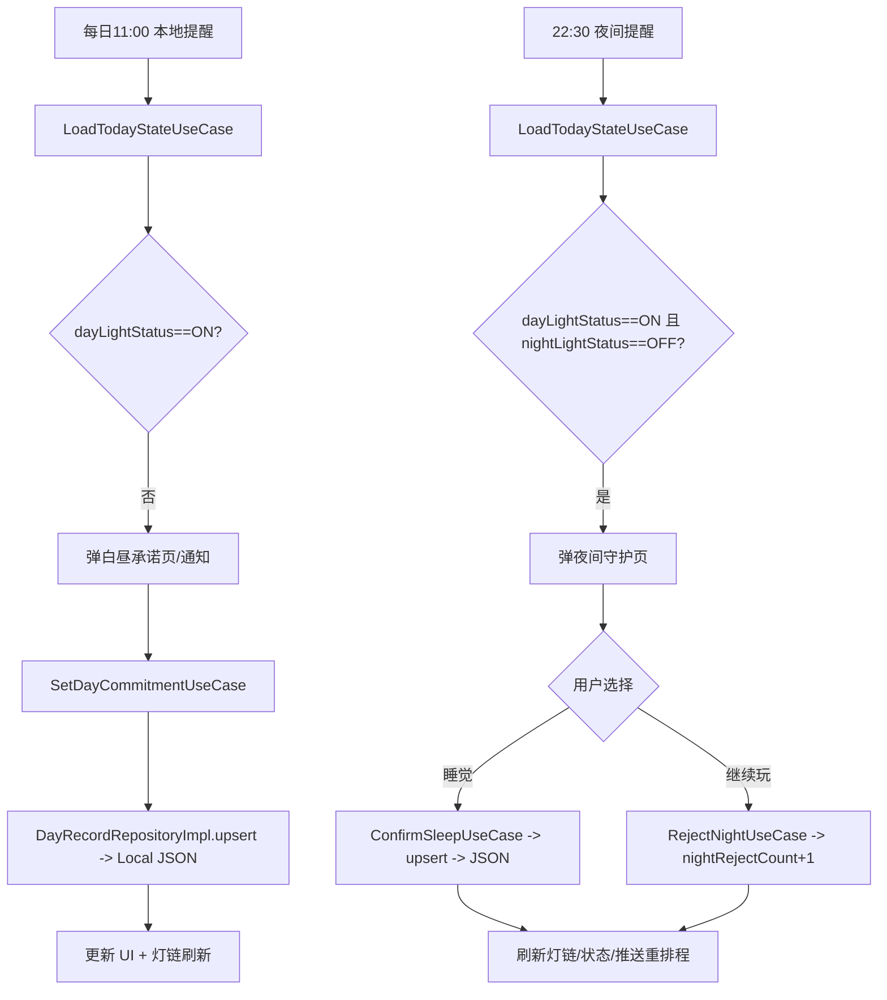

# Daylight PRD（MVP 存档）

## 新版本更新（1.3.4）
- 目的：将现有 Text 渐进替换为 `.daylight(...)`，统一字体/颜色/折行/缩放策略，保持视觉不变且不改文案。
- 范围：仅 Presentation 层显式 Text；Domain/Data/Core/通知不改；新增 Snapshot 用例覆盖 `.daylight` 常用样式防回归。
- 影响面：Today/DayCommitment/NightGuard/LightChain/Settings/Dev/App 的文本样式调用入口；默认色为白色 90%，可透传自定义 color。
- 验收要点：替换后 UI 视觉与现有一致（含中英文、大字号）；GlowGold/次级文本需传 `color:`；Snapshot/UI 测试基线通过；编译通过。

### ASCII 原型（统一样式调用）
```
[Today Header]
 GlowingSun
 HomeTitle    -> .daylight(.hero, color:white90%, alignment:.center, lineLimit:2)
 HomeSubtitle -> .daylight(.bodyLarge, color:white80%, alignment:.center, lineLimit:2)

[LightChain Bar]
 o o o o o o o

[Day Grid]
 Su Mo Tu ...     (weekday -> .caption2, color: calendarArrow or white70%)
 [28][29][30]...  (day -> .caption1, color: status.textColor)

[DayCommitment]
 标题 -> .daylight(.title2, alignment:.center, lineLimit:2)
 文本框/建议 -> .daylight(.body2/.body2Medium, color:white)

[NightGuard]
 标题 -> .daylight(.display, color:glowGold, alignment:.center, lineLimit:2)
 副文 -> .daylight(.body, color:white80%, alignment:.center)

[LightChain Cards]
 PrimaryCard: title .display glowGold | subtitle .headline glowGold | streak .streakNumber + .subhead
 CalendarCard: 月份 .callout(calendarMonth) | weekday .caption2 white70% | day .caption1(status color)
 DetailCard: title .headline glowGold | 日期 .caption1Medium | 正文 .body2Medium | 空态 .body2Medium white60%
 StreakCard: title .headline glowGold | 副文 .footnoteMedium | 数字 .body2Medium
 DayRecordStatusCard: 日期 .caption1Medium | 状态标题 .headline glowGold | 描述/承诺/睡眠/拒绝 .footnote/.footnoteMedium

[Settings/Dev/App]
 Section title -> .subheadSemibold white90%
 label -> .body2 white80% | 描述/警告 -> .caption/.caption1Medium (tertiary/statusError)
 Dev 标题 -> .devTitle | 按钮 -> .callout | 取消 -> .body2
 App 错误/加载 -> .headline/.body (white90%/80%)
```

### 技术架构与要点更新
- 样式入口：复用已有 `Text.daylight(style,color:,alignment:,lineLimit:,minimumScaleFactor:)`，默认 `white + DaylightTextOpacity.primary`，保留 `fixedSize(vertical:true)` + `layoutPriority(1)`。
- 色彩策略：GlowGold/次级/三、四级文本通过 `color:` 传递，禁止新增颜色 Token；保留既有透明度常量。
- 折行/缩放：单行标题按需 `lineLimit(1)` + 自定义 `minimumScaleFactor`；长文案保留多行；大字号模式不截断。
- 模块隔离：仅改 Presentation 层 Text；按钮/布局不变；不触碰 Domain/Data/Core/通知。
- 测试：新增 Snapshot/UI 用例覆盖 `.daylight` 典型样式（默认色、GlowGold、高字号、多行）；运行 xcodebuild 编译通过。

## 新版本更新（1.3.3）
- 目的：为 Text 提供统一样式出口，复用现有 DaylightTypography/Colors/Opacity，避免散点配置导致视觉漂移和维护成本。
- 范围：新增 UI 封装 `DaylightTextStyle` + `Text.daylight(...)`（仅 Presentation 层）；不改 Domain/Data/Core/通知。
- 影响面：后续 Text 可渐进替换为 `.daylight(...)` 统一字体/颜色/缩放/折行策略；默认行为保持现有视觉。
- 验收要点：新增组件可用且编译通过；默认样式与现有 Token 一致；未改动的页面行为不变。

### ASCII 原型（统一样式调用示例）
```
[标题区]
Text(title).daylight(.title2, alignment:.center, lineLimit:2)
Text(subtitle).daylight(.bodyLarge, alignment:.center,
                        color:.white.opacity(DaylightTextOpacity.secondary))

[卡片]
Text(header).daylight(.display, color: DaylightColors.glowGold)
Text(desc).daylight(.headline,
                    color: DaylightColors.glowGold.opacity(DaylightTextOpacity.primary))

[设置行]
Text(label).daylight(.body2)
Text(value).daylight(.body2Medium,
                     alignment:.trailing,
                     color:.white.opacity(DaylightTextOpacity.secondary))
```

### 技术架构与要点更新
- 样式映射：`DaylightTextStyle` 仅包含项目实际使用的字体样式（hero/display/title2/title3/headline/subhead/subheadSemibold/bodyLarge/body2/body2Medium/footnote/footnoteMedium/footnoteSemibold/caption1/caption1Medium/caption2/caption/callout/streakNumber/devTitle/body），直接映射到已有 `DaylightTypography`。
- 颜色策略：默认使用白色 + `DaylightTextOpacity.primary`，可显式传入自定义 `color`；保留 `alignment`、`lineLimit`、`minimumScaleFactor`。
- 防压缩：内置 `fixedSize(vertical:true)` + `layoutPriority(1)`，避免复杂布局下被挤压；轻量缩放 `minimumScaleFactor(0.9)` 默认开启，可覆盖。
- 模块隔离：新增文件放在 DesignSystem/Components，不修改任何现有接口或 Token，保持其他模块行为不变。

## 新版本更新（1.3.2）
- 目的：跨日夜窗下月历高亮与详情卡错位（todayKey=昨天，详情卡/占位显示今天或跳占位）的问题彻底对齐；Today 内嵌统计与 LightChain 页统一使用夜窗切日后的 todayKey 与归一化记录。
- 范围：仅 Presentation 层的月度数据归一化与选中逻辑（TodayView/TodayViewModel/LightChainPage）；复用既有切日工具与接口，不改 Domain/Data/Core/通知。
- 影响面：Today 内嵌统计卡、LightChain 顶部/底部日历、详情卡的默认选中与数据来源；其他页面与存储/通知保持不变。
- 验收要点：跨日窗口 22:30–00:30，时间 00:10 打开 Today 或 LightChain，月历高亮昨天且详情卡展示昨天记录（无则昨天占位）；同日窗口行为不变；重复记录不覆盖真实 today 条目；编译通过。

### ASCII 原型（Today 内嵌统计 @ 00:10, 夜窗 22:30-00:30）
```
┌───────────────┐
│ 月份: 2024-11 │  ← month 由 todayKey=2024-11-30 推导
│ ... 28 29 [30] 1 ...  ← 高亮 todayKey=30
└───────────────┘
┌───────────────────────┐
│ 详情卡: 2024-11-30     │  ← 归一化记录（无则占位）
│ 承诺: ... | 入睡: --   │
└───────────────────────┘
```

### ASCII 原型（LightChain Page 同步状态）
```
┌───────────────┐              ┌───────────────────────┐
│ 月历高亮 [30] │              │ 详情卡: 日期 11-30     │
└───────────────┘              │ 承诺/入睡/拒绝: ...    │
                               └───────────────────────┘
(上下卡片、网格、初始选中全部使用 normalizedRecords；无跳变/占位错位)
```

### 技术架构与要点更新
- 月份锚定：统一用夜窗切日得到的 todayKey 转回 Date 作为“有效今天”月份，避免午夜跨月错误加载。
- 归一化：渲染前使用 `normalizedMonthRecords(todayKey:)` 生成 UI-only 覆盖记录，仅在缺失 todayKey 时补齐，保留真实同日记录。
- 数据源统一：Today 内嵌统计与 LightChain 页全部组件（月历、详情卡、主卡片）共享归一化记录，不再混用原始 monthRecords。
- 模块隔离：仅 Presentation 层变更；Domain/Data/Core/通知与接口签名保持不变。

## 新版本更新（1.3.1）
- 目的：跨日夜间窗口（最晚入睡在 0 点后）时，日历高亮当天但详情卡显示前一天的问题兜底；确保今天的 dayKey 与详情展示一致。
- 范围：LightChain/Today 统计视图的“今日记录”选中逻辑；仅 UI 层做 dayKey 纠偏，不改存储/通知/用例。
- 影响面：LightChain 月历初始选中、今日详情卡、Today 内嵌统计卡片；其他模块保持不变。
- 验收要点：跨日窗口 22:30–00:30，打开日历时高亮 27，则详情卡日期也为 27（若无数据则用 27 的占位记录）；同日窗口行为不变；编译通过。

### ASCII 原型（今日覆盖记录兜底）
```
[LightChain 初始状态，跨日窗口]
┌──────────────────────────┐
│  ◄  Nov 2024  ►          │
│  ... 25 26 [27] 28 ...   │  ← 高亮 todayKey=27
└──────────────────────────┘
┌──────────────────────────┐
│  日期: 2024-11-27         │  ← 详情卡强制使用 todayKey
│  承诺: (占位或今日记录)    │
│  入睡: --   拒绝次数: 0    │
└──────────────────────────┘
```

### 技术架构与要点更新
- 今日覆盖映射：渲染前构建 `normalizedRecords`，对月度记录用 `DateHelper.localDayString(updatedAt, window)` 重算 dayKey，若重算为 todayKey 且原 dayKey 不同，则生成覆盖记录仅供 UI 使用。
- 默认选中：LightChainPage 和 TodayView 统计加载时优先使用 `normalizedRecords[todayKey]`，否则 fallback 至原记录或占位记录，保证高亮与详情一致。
- 模块隔离：仅 Presentation 层调整选中逻辑，不改 Domain/Core/通知/存储；调用签名不变。

## 新版本更新（1.3.0）
- 目的：修正“最早/最晚入睡时间”导致的 dayKey 错乱与双重回退，保障 UI、统计、通知的日期一致性，并对异常配置兜底。
- 范围：`DateHelper` 切日规则与分界计算、LightChain 今日高亮计算、设置页夜间窗口校验与默认回写、Settings 本地存储的窗口合法性检查。
- 影响面：主页标题/副标题、CTA 状态、灯链高亮/详情、日历初始选中、定时刷新/通知 dayKey 均跟随修正后的切日；非法窗口会被阻止保存并回落为默认窗口 22:30–00:30。
- 验收要点：同日窗口（21:30–23:59）任意时间均属当天；跨日窗口（22:30–01:30）仅 00:00–01:30 归前一天，01:31 起为当天；end<start 或无效时间不会写入/读取，设置页给出提示；LightChain 高亮与详情日期不再回退。

### ASCII 原型（受影响区域）
```
[Today 页 @ 22:45, 窗口 21:30-23:59（同日）]
┌──────────────────────────────────────┐
│  2024-08-26  白昼之灯                 │
│  “今天也要发光”                      │
│  [点亮白昼]  [现在睡觉]              │
│  灯链: o o o O o o o  (高亮当天)     │
└──────────────────────────────────────┘

[LightChain 日历 @ 跨日窗口 22:30-01:30]
┌───────────────────────────────┐
│  ◄  Aug 2024  ►               │
│  ... 24 25 [26] 27 ...        │
│  详情卡: 日期 08/26，与高亮一致   │
└───────────────────────────────┘

[设置页 - 夜间窗口校验]
┌─────────────────────────────────────┐
│ 最早入睡 [22:30]  最晚入睡 [00:30]  │
│ 提示: 最晚需晚于最早（支持跨日）    │
│ ! 最晚入睡需晚于最早入睡，请调整    │
└─────────────────────────────────────┘
```

### 技术架构与要点更新
- 切日规则：`DateHelper` 解析窗口（含 crossesMidnight），仅跨日且 `now<=end` 回退一天；同日窗口始终用自然日；`nextLocalDayBoundary` 跨日用 `end+1`，同日固定次日 00:00；解析失败/0 长度回落默认窗口。
- 数据兜底：`SettingsLocalDataSource` 读取时校验夜间窗口，非法值写回默认 22:30–00:30，避免脏配置继续传播。
- 设置校验：`SettingsPage` 本地校验窗口长度>0，非法时阻止保存并展示提示。
- 调用链一致：LightChain 只使用一次 `todayKey` 计算避免双重回退；其他模块接口不变。

## 新版本更新（1.2.0）
- 目的：建立以真实界面为基准的 Design System，消除页面硬编码样式（颜色/字体/圆角），提升 UI 一致性与可维护性。
- 范围：`DesignTokens.swift` 扩展新 Token；新增 5 个通用组件；8 个页面文件替换硬编码为 Token 引用。
- 影响面：所有页面视觉保持不变，仅代码层替换；Data/Domain/Core 层完全不受影响。
- 验收要点：编译通过；所有页面 UI 无视觉回归；`grep -r "Color(red:" Daylight/` 返回 0 结果；废弃 Token 产生编译警告。

### ASCII 原型（Design Token 架构）
```
┌─────────────────────────────────────────────────────────────────┐
│                    DesignTokens.swift                           │
├─────────────────────────────────────────────────────────────────┤
│  DaylightColors (基于真实界面)                                   │
│  ├── 背景: bgPrimary #5D8C8D | bgNight #0C2740                  │
│  ├── 交互: actionPrimary #467577                                │
│  ├── 灯光: glowGold #FFECAD (+ opacity variants)                │
│  ├── 覆盖: bgOverlay08/12/15/18 (white opacity)                 │
│  ├── 渐变: cardPrimary/calendarDark/streak/detail/sun           │
│  └── 状态: statusSynced/Failed/Syncing                          │
├─────────────────────────────────────────────────────────────────┤
│  DaylightTypography (13 级字体)                                  │
│  ├── hero(38) > display(36) > title1(34) > title2(30)           │
│  ├── title3(26) > headline(22) > subhead(20) > bodyLarge(19)    │
│  └── callout(18) > body2(16) > footnote(15) > caption1/2(14/13) │
├─────────────────────────────────────────────────────────────────┤
│  DaylightRadius (11 级圆角)                                      │
│  └── xl(34) > lg(30) > button(28) > card(26) > capsule(24)      │
│      > md(22) > sm(16) > nav(14) > xs(12) > xxs(10) > pill(999) │
├─────────────────────────────────────────────────────────────────┤
│  DaylightTextOpacity                                            │
│  └── primary(0.9) | secondary(0.8) | tertiary(0.7) | muted(0.6) │
└─────────────────────────────────────────────────────────────────┘
```

### ASCII 原型（组件体系）
```
┌─────────────────────────────────────────────────────────────────┐
│                     DesignSystem/Components                     │
├─────────────────────────────────────────────────────────────────┤
│  DaylightPrimaryButton (更新)                                    │
│  ┌─────────────────────────────────────────┐                    │
│  │  bg: actionPrimary | text: white 90%   │                    │
│  │  font: headline(22) | radius: button(28)│                    │
│  └─────────────────────────────────────────┘                    │
├─────────────────────────────────────────────────────────────────┤
│  DaylightSecondaryButton (新增)                                  │
│  ┌─────────────────────────────────────────┐                    │
│  │  bg: overlay12 | text: glowGold 90%    │                    │
│  │  font: subhead(20) | radius: button(28) │                    │
│  └─────────────────────────────────────────┘                    │
├─────────────────────────────────────────────────────────────────┤
│  DaylightGhostButton (新增)                                      │
│  ┌─────────────────────────────────────────┐                    │
│  │  bg: overlay08 | text: white 90%       │                    │
│  │  radius: xs(12)                         │                    │
│  └─────────────────────────────────────────┘                    │
├─────────────────────────────────────────────────────────────────┤
│  GlowingSun / GlowingMoon (新增)                                 │
│         ╭─────────────╮                                         │
│      ╭──┤  glowGold   ├──╮   三层光晕: 50% blur60               │
│      ╰──┴─────────────┴──╯              60% blur30              │
│                                        100% core                │
├─────────────────────────────────────────────────────────────────┤
│  LightDot (新增)                                                 │
│  ● on: glowGold + shadow    ◐ partial: glowGold 55%            │
│  ○ off: white 25%                                               │
└─────────────────────────────────────────────────────────────────┘
```

### 技术架构与要点更新
- Token 补全：在 `DesignTokens.swift` 中基于真实界面新增约 50 个 Token（颜色/字体/圆角/透明度/渐变），旧未使用 Token 标记 `@available(*, deprecated)`。
- 组件新增：`SecondaryButton`/`GhostButton`/`GlowingSun`/`GlowingMoon`/`LightDot` 封装通用 UI 模式。
- 页面迁移：8 个文件的硬编码样式替换为 Token（TodayView/NightGuardPage/SettingsPage/LightChainPage/LightChainVisualizationComponents/DeveloperToolsPage/PrimaryButton）。
- 隔离验证：Data/Domain/Core 层无任何改动，回归风险限定在 Presentation 层视觉。

### 文件变更清单
| 类型 | 文件 | 说明 |
|------|------|------|
| 修改 | DesignSystem/DesignTokens.swift | 新增 Token + 废弃标记 |
| 修改 | DesignSystem/Components/PrimaryButton.swift | 更新配色 |
| 新增 | DesignSystem/Components/SecondaryButton.swift | 次级按钮 |
| 新增 | DesignSystem/Components/GhostButton.swift | 幽灵按钮 |
| 新增 | DesignSystem/Components/GlowingSun.swift | 光晕组件 |
| 新增 | DesignSystem/Components/LightDot.swift | 灯珠组件 |
| 修改 | Presentation/Today/TodayView.swift | 替换硬编码 |
| 修改 | Presentation/Today/NightGuardPage.swift | 替换硬编码 |
| 修改 | Presentation/Settings/SettingsPage.swift | 替换硬编码 |
| 修改 | Presentation/LightChain/LightChainPage.swift | 替换硬编码 |
| 修改 | Presentation/LightChain/Components/... | 替换硬编码 |
| 修改 | Presentation/Dev/DeveloperToolsPage.swift | 替换硬编码 |

## 新版本更新（1.1.8）
- 目的：设置页保存与通知重排节流，拖动/输入不再频繁写文件或重复授权；昵称仅在确认/失焦时提交。
- 范围：`SettingsPage` 视图层的保存触发与昵称提交逻辑；底层 ViewModel/通知排程/其他模块不变。
- 影响面：日/夜提醒时间、夜间开关、间隔、承诺展示、昵称的保存频率；同步状态条、语言/开发工具、其他页面/数据契约均保持不变。
- 验收要点：连续拖动时间/Picker/Toggle 仅在停顿 ~400ms 后触发一次 `saveSettings` 与通知重排；昵称输入时不触发写入，按键盘完成或失焦才提交且仅在变更时调用；无额外授权弹窗或跨模块回归。

### ASCII 原型（设置页受影响区域）
```
+------------------------------------------------------+
| Settings                                             |
| [● Synced · Next retry HH:MM]                        |
|                                                      |
| Profile                                              |
|  Nickname: [ Zora                 ][Done]            |
|  hint: auto-saves on Done or when the field blurs    |
|                                                      |
| Reminder                                             |
|  Day time      [ 08:00 ]                             |
|  Night mode    [ on/off toggle ]                     |
|  Night start   [ 23:00 ]    Night end   [ 07:00 ]    |
|  Interval      [ 30 min ▼ ]                          |
|  Show intention in notification [ toggle ]           |
|                                                      |
| Language  [ System | 中文 | English ]                |
| Dev tools ...                                        |
+------------------------------------------------------+
```

### ASCII 原型（交互与节流）
```
User changes picker/toggle
        ↓
 settingsForm @State (Equatable snapshot)
        ↓ onChange
 PassthroughSubject.send(form)
        ↓ debounce(for: 0.4s, scheduler: main)
 DebouncedSettingsSaver.fire(form)
        ↓
 viewModel.saveSettings(...)  // single call after idle
        ↓
 repo -> file write + notification scheduling (unchanged)
```

### ASCII 原型（昵称提交流）
```
TextField(nickname, submitLabel: .done)
    ↓ onSubmit OR onChange of isNicknameFocused to false
commitNicknameIfChanged()
    ↓
viewModel.updateNickname(newName)  // only when value changed
```

### 技术架构与要点更新
- 保存节流：引入 `DebouncedSettingsSaver`（私有于 SettingsPage），汇聚 `settingsForm` 变更到 `PassthroughSubject`，`removeDuplicates` + `debounce(400ms)` 后统一调用 `saveSettings`。
- 监听简化：六个 `.onChange` 合并为单个 `settingsForm` 监听，视图状态组装成 `Equatable` 结构体避免重复触发。
- 昵称提交：增加 `@FocusState` 与 `lastCommittedNickname`，`.submitLabel(.done)` + 失焦触发 `commitNicknameIfChanged`，仅在值变更时调用 `updateNickname`。
- 同步保护：`syncWithSettings` 初始化时同步 `lastCommittedNickname`，`didLoad` 前的变更不触发提交；不改 ViewModel 接口与通知/存储模块，回归风险限定在设置页。

## 新版本更新（1.1.7）
- 目的：夜间提醒次数随时间窗与间隔动态生成，跨日窗口不截断；授权弹窗仅在首次/未授权时出现，重排程不再重复弹窗。
- 范围：`NotificationScheduler` 夜间排程逻辑与授权流程；新增夜间时间生成器与 ID 清理；其他模块不变。
- 影响面：夜间通知触发次数与时间；授权触发时机；日间提醒与 UI/数据用例保持不变。
- 验收要点：22:00–02:00 间隔 20 分钟应排程 13 条 pending 请求（跨日触发完整）；start=end 只排一次；night interval<=0 不排程；多次 reschedule 不弹授权；`clearNightReminders` 能清掉旧版 ID。

### ASCII 原型（夜间时间线示例）
```
夜间窗口：22:00–02:00，间隔 20m
22:00 22:20 22:40 23:00 23:20 23:40 00:00 00:20 00:40 01:00 01:20 01:40 02:00
|----|----|----|----|----|----|----|----|----|----|----|----|----|  共 13 次
```

### ASCII 原型（排程/授权解耦流程）
```
[App 启动/设置变更]
   |-- ensureAuthorization()   // 仅在未决时弹窗
   |
   |-- reschedule(settings, dayKey, nextDayKey, context)  // 不再触发授权
          |- clearLegacyRequests()
          |- clearStoredRequests()
          |- scheduleDaily(dayKey):
                * buildDayRequest()
                * times = nightReminderTimes(start,end,interval)
                * for t in times: buildNightRequest(round: idx+1)
          |- saveScheduled(ids, dayKey)
```

### 技术架构与要点更新
- 夜间触发生成器：`nightReminderTimes(start,end,interval)` 根据窗口长度 + 间隔推算全部分钟数，跨日取模 24h；间隔<=0 返回空；start=end 仅保留起点。
- 动态 ID：`daylight_night_<dayKey>_<roundIdx>` 与轮次绑定，`makeNightContent` round==1 用第一套文案，round>=2 复用第二套；`clearRequests(for:)` 通过前缀查找 pending 全量清理。
- 授权解耦：新增 `ensureAuthorization()`，仅 `.notDetermined` 时调用 `requestAuthorization`；`reschedule` 使用 `notificationsEnabled()` 早退，避免重复弹窗。
- 兼容与清理：保留 `legacyNightReminderIds` 清除旧版；`saveScheduled` 存储实际生成的 ID 供后续清理，日间提醒逻辑不变。

## 新版本更新（1.1.6）
- 目的：为待同步队列补齐出站重放与退避，避免 `pending_ops.json` 无上限增长；设置上传失败可见且可手动重试（UI 暂隐藏，待真实云端接入后再显）。
- 范围：PendingSync 支持 DayRecord + Settings；Repository 入队/成功出队/失败退避；新增 SyncReplayer（启动/前台/网络恢复/手动重试触发）；设置页同步状态条代码已就绪但默认隐藏。
- 影响面：本地写入、通知排程与其他页面不变；仅影响待同步文件与设置同步逻辑；队列限定 200 条、同 ID 覆盖。
- 验收要点：离线修改设置/日迹会入 `pending_ops.json`；前台/网络恢复后自动上传并删除；手动“立即重试”调用后可触发上传；退避节奏 5s 起指数递增、封顶 10 分钟，无爆刷。

### ASCII 原型（同步流）
```
[TodayViewModel/UseCases] --save--> [DayRecordRepo / SettingsRepo]
           |                         | on failure
           |                         v
           |                 [PendingSyncLocalDataSource]
           |                         |
           |<---status banner--------+
           |
[AppContainer] starts SyncReplayer (actor)
           |
   triggers: app launch, scenePhase .active,
             NWPathMonitor 网络恢复，手动 Retry
           v
   SyncReplayer loads pending_ops.json
           |
   batch by type -> remote.upload(...)
           |
   success -> removePending(id)
   failure -> retryCount +=1, lastTryAt=now, backoff (min(2^n*5s, 10m))
```

### ASCII 原型（设置页顶部状态，当前隐藏，待云端接入后放出）
```
+--------------------------------------------------------------+
| Settings                                                     |
| [SYNC STATUS BAR - hidden by default until live backend]     |
|  - OK: "已同步到云端"                                         |
|  - Pending/failed: "本地已保存，待网络恢复自动重试" [Retry]   |
+--------------------------------------------------------------+
| Day reminder time   [08:00 ▾]                                |
| Night enable        [ON ]                                    |
| Night window        [23:00 - 07:00]                          |
| Night interval      [30 min ▾]                               |
| Show commitment     [ON ]                                    |
+--------------------------------------------------------------+
```

### 技术架构与要点更新
- PendingSyncItem.payload 改为枚举（dayRecord/settings），id 由 type + payloadId 生成，队列上限 200 条，重复 ID 覆盖。
- DayRecord/Settings Repository：本地成功写入后，远端成功即出队，失败时入队（retryCount 递增，lastTryAt=now），Settings 失败抛 syncFailure 供 UI 提示。
- SyncReplayer（actor）：读 pending_ops.json，按类型批量上传（DayRecord 成批，Settings 单个），失败写回并计算退避；支持 filters + force（手动重试跳过退避）；App 启动/前台/网络恢复触发。
- AppContainer：持有 SyncReplayer，场景变化/NWPathMonitor 恢复时触发 replay，并回传 Snapshot 更新 VM 状态。
- TodayViewModel + SettingsPage：新增 settingsSyncState（idle/syncing/pending/failed/synced），同步失败不弹阻断框，顶部状态条显示下一次重试时间并提供“立即重试”。

## 新版本更新（1.1.5）
- 目的：日迹查询与写入强制按 `userId` 隔离，为多账号/多设备场景消除串读/误写风险。
- 范围：`DayRecordRepository` / `DayRecordLocalDataSource` API 全量改为带 `userId`；调用链（Today/LightChain/Streak/Month 用例与 VM）传递并过滤；持久化过滤 `loadAll(for:)`，写入校验 `record.userId`。
- 影响面：今日状态、灯链、连击、月历、通知排程读取的日迹均按当前用户过滤；待同步队列继续写入同一记录 ID（含 userId），不影响其他模块。
- 验收要点：切换/模拟不同 `userId` 仅能读到自身日迹；插入其他用户记录不会出现在当前用户 UI/统计；旧单用户数据仍可读取（默认以当前用户 ID 过滤）。

### ASCII 原型（userId 过滤数据流）
```
[ViewModel (userId)] -> [UseCases(userId)] -> [DayRecordRepositoryImpl]
        |                                |
        | record/records/latest/upsert   | loadAll(for:userId)
        v                                v
  UI 渲染/统计                    DayRecordLocalDataSource
                                        |
                                        | filter .userId == userId
                                        v
                             day_records.json (按 userId + date 合并/排序)
```

### 技术架构与要点更新
- Repository 公共方法签名全部携带 `userId`，默认不再暴露无用户的查询/写入入口。
- LocalDataSource 增加 `loadAll(for:)` 按 `userId` 过滤；写入前确保 `record.userId` 一致，仅覆盖同用户同日期记录，其他用户数据保留。
- 连击/灯链/月视图用例依赖的批量读取改为 userId 限定；Mock 数据播种写入同一用户 ID，避免污染。
- 数据契约不变（DayRecord 已含 userId 字段）；如需迁移旧数据，以当前登录用户 ID 作为默认过滤。

## 新版本更新（1.1.4）
- 目的：跨日后本地通知按“本地日”生成一次性内容，避免复用前一日承诺/昵称，夜窗跨日不再推送旧文案。
- 范围：`NotificationScheduler` 一次性排程/ID 增加 dayKey + userInfo；`TodayViewModel` 前台/日切换重排，持久化 lastScheduledDayKey；沿用 `DateHelper.localDayString`。
- 影响面：日/夜通知文案、deeplink、提醒触发时间；其他 UI/数据用例保持不变。
- 验收要点：0:00 后收到的新提醒对应当日文案；夜窗跨日（例 22:30–04:00）凌晨提醒不带前一日承诺；前台唤醒自动重排，无重复/漏排。

### ASCII 原型（通知排程）
```
[DateHelper.localDayString] --dayKey--> [TodayVM.scheduleNotifications]
        | scenePhase/.timer             |
        v                               v
   dayKey check & refresh ----> [NotificationScheduler.scheduleDaily]
                                        |
                                        | one-shot requests (id=daylight_{day|night}_{dayKey})
                                        v
                       [UNUserNotificationCenter.pendingRequests]
```

### ASCII 时间线（跨日夜窗示例）
```
calendar day:    D             D+1
clock:        00:00   04:00   12:00   23:00   02:00(next day)
local dayKey=D |----属前一日----|----------当日-----------|--仍属dayKey=D--|
                 ^ 重排D         ^ 日提醒D                ^ 夜1(D)         ^ 夜2(D)
```

### 技术架构与要点更新
- 通知改为非重复：日/夜提醒使用当日 `UNCalendarNotificationTrigger(repeats:false)`，ID 带 dayKey，`userInfo` 附带 `dayKey` + `deeplink`。
- 跨日校正：夜窗跨日时，`time <= nightEnd` 归属 dayKey 次日凌晨，其余归属 dayKey 当日；已过时刻不再补发。
- 排程时机：`refreshAll`、跨日定时器、前台唤醒都会比对 dayKey 变化并重排；若 dayKey 未变但 `lastScheduledDayKey` 不一致，会重新排程。
- 持久化：`UserDefaults` 记录 `lastScheduledDayKey` 与下发的 request IDs，重排前清理旧日/legacy ID，避免重复与误推。

## 新版本更新（1.1.3）
- 目的：跨日后主页/统计/通知自动切换到新日，消除午夜后停留在前一日数据的 UI/排程。
- 范围：`TodayView` / `TodayViewModel` / `DateHelper`；仅新增跨日监听（前台+定时），复用现有用例与通知排程，不改数据契约。
- 影响面：主页 CTA/标题、灯链、统计卡、通知重排程均基于新日记录；切日规则沿用 `localDayString(nightWindow:)`（00:00–夜窗结束视作前一日）。
- 验收要点：午夜后 1 分钟内 UI/统计/通知切到新日；从后台回前台也能同步；白天场景无变化。

### ASCII 原型（跨日自动刷新）
```
主屏（跨日后自动切换）
+----------------------------------------------------+
| [⚙︎]  标题/副标题（绑定新日 record）              |
| [白昼 CTA]  [夜间 CTA*]                            |
| o o o o o o o   (灯链含新日占位/状态)              |
| Stats 展开：月份=新日所在月，选中=新日             |
| * 夜间 CTA 仅当白昼 ON 且夜窗内                    |
+----------------------------------------------------+

跨日刷新流程
[定时器 -> nextLocalDayBoundary] --\
                                     > refreshIfNeeded -> refreshAll -> 通知重排程
[scenePhase == active] ---------------/
```

### 技术架构与要点更新
- DateHelper：新增 `nextLocalDayBoundary(after:nightWindow:)`，与 `localDayString` 同步切日（夜窗结束 + 1 分钟）。
- TodayViewModel：记录 `lastDayKey`，`dayChangeTask` 睡眠到边界触发 `refreshIfNeeded`；前台唤醒/定时两路触发 `refreshAll`，切日后重排通知并在需要时刷新月度数据。
- TodayView：监听 `scenePhase`，前台时触发 `refreshIfNeeded`，确保后台返回也更新。
- 防重：`state.isLoading` + `dayChangeTask.cancel()` 避免重入；未改存储/用例/其他模块。

## 新版本更新（1.1.2）
- 目的：夜间窗口（默认 22:30–00:30）内的“今日”使用切日规则，消除 CTA/灯链/统计在 00:00–00:30 出现的错位。
- 范围：`TodayView`、`LightChainPage` 及相关统计组件的 todayKey 生成与默认月份锚定；仅调整视图层取数，不改写底层用例/存储。
- 影响面：主页 CTA、夜间守护入口、灯链圆点、月视图默认选中与 streak/状态卡展示；日夜写入逻辑与提醒排程保持不变。
- 验收要点：夜窗内（如 00:10）UI 仍指向前一日记录，月视图落在前一日所在月份；白天与常规场景显示不变。

### ASCII 原型（夜窗对齐的今日键）
```
Today（主屏，stats 收起）
+----------------------------------------------------+
| [⚙︎]                                             |
|            (glowing sun)                          |
|  标题/副标题                                      |
|  [今日行动 CTA]                                   |
|  [夜间守护 CTA]  (夜窗内显示)                     |
|  ●●●●●●●  LightChain  (todayKey=localDayString)  |
+----------------------------------------------------+

Today（展开统计）
+----------------------------------------------------+
| [<] 2024-03 [>]   (month == effectiveToday 月)     |
| Su Mo Tu ...                                       |
| ... .. **Td** .. ..                                |
| Primary card  | streak                             |
| DayRecordStatusCard(todayKey 传入)                 |
+----------------------------------------------------+

LightChain Page
+----------------------------------------------------+
| Primary card                                      |
| Streak calendar (initialSelection=todayKey)       |
| DayRecordStatusCard(todayKey)                     |
| Sun card | Calendar card | Detail | Streak card   |
+----------------------------------------------------+
```

### 技术架构与要点更新
- todayKey 统一入口：`TodayViewModel.todayKey/todayDate` 用 `dateHelper.localDayString(nightWindow:)`（无设置时回退自然日）。
- 视图对齐：`TodayView` 统计卡、`LightChainPage` 初始选中/状态卡/loadMonth 默认都用 todayKey；月视图首次加载若跨月则锚定到有效今日所在月。
- 数据契约/用例/存储保持不变；仅变更 key 计算与默认月度加载，确保夜窗跨日 UI 与数据一致。

## 新版本更新（1.1.1）
- 目的：修复灯链 streak 统计，缺失日期不再被计入连续天数，确保当前/最长连击与真实完成日期一致。
- 范围：仅影响 `GetStreakUseCase` 计算逻辑与依赖注入（追加 `DaylightDateHelper` 以统一时区/日历），UI 及其他用例保持不变。
- 影响面：灯链/主页 streak 数字（current/longest）；既有灯链渲染与提醒节奏不受影响；占位日依旧填充但不参与连击。

### ASCII 原型（灯链/连击校验）
```
灯链（逆序用于 current）:
11/03 ●●  -> 计数=1, last=11/03
11/02 --  -> 断档，current 停止于 1
11/01 ●●  -> 不连续，不加入 current；longest 仅按连续片段计算

连击计算（升序用于 longest）:
11/01 ●●  => streak=1, longest=1
11/02 --  => reset=0
11/03 ●●  => streak=1（重新开始），longest=1
```

### 技术架构与要点更新
- `GetStreakUseCase` 注入 `DaylightDateHelper`；内部 `Calendar` 同步 `timeZone`，避免跨时区误差。
- current 计算：逆序遍历，只有 `.on/.on` 且日期恰为上一日才累加；遇到缺失/未完成或日期跳变即停止。
- longest 计算：升序遍历，连续日累加，不连续则从 1 重启；无效日期直接重置。
- 数据契约/其他模块（提醒、灯链填充、存储）无改动，回归测试聚焦 streak 数字与边界日期（缺失日、逆序日期、跨夜窗口）。

> 约束：当前 SwiftUI 已实现的三个页面（入口/白昼承诺/夜间守护）视觉效果需保持，仅在此基础上补强文案、提醒节奏与交互细节。

## 核心目标（Mission）
用日夜双灯机制，帮助 18–35 岁报复性熬夜者在不增加焦虑的前提下戒掉熬夜冲动。

## 用户画像（Persona）
- 报复性熬夜者（上班族+学生），白天被挤压，夜晚补偿性刷手机。
- 需要简单、温和、无数据压力的“自我守护”工具；对隐私敏感。
- 中英双语用户，讨厌轰炸式提醒；手机依赖强，iPhone 首发。

## V1: 最小可行产品（MVP）
- 白昼承诺：11:00 默认提醒；一句话承诺 1–80 字；内置 8 条推荐理由；点亮白昼灯。
- 夜间守护：22:30–00:30 窗口，两次本地提醒（默认 30 分钟间隔）；仅当日白昼灯 ON 才弹；“睡觉”点亮夜间灯，“继续玩”计数。
- 灯链：展示 7–14 天双灯状态；点击看承诺与睡觉时间；断档不惩罚。
- 设置：可调提醒时间/夜间开关；完全离线存储；双语文案。
- 本地推送：仅本地通知；权限拒绝时前台弹窗兜底。
- 数据：匿名本地用户，JSON 存储 DayRecord/Settings，schemaVersion 预留，pending sync stub 保留但默认不上传。

## 调试用模拟数据（Debug）
- 默认关闭；Release 永远关闭。
- 开启：Xcode Scheme → Run → Arguments，添加 Launch Argument `-USE_MOCK_DATA`（或环境变量 `USE_MOCK_DATA=1`）。如需内存版远端 stub，再加 `-USE_REMOTE_STUB`。
- 数据来源：`Resources/Mocks/mock-data.json`（可替换同名文件自定义）。
- 关闭：移除上述开关即可；如之前写入了 mock 数据，可卸载 App/重置模拟器以清掉本地存储。

## 当前实现进度（代码自查）
- 已对齐：SwiftUI 入口/白昼承诺/夜间守护页面视觉与灯链/设置页；本地化（en/zh-Hans）与语言切换、昵称配置已接通。
- 已落地核心用例：LoadTodayState/SetDayCommitment/ConfirmSleep/RejectNight/LoadLightChain/GetStreak/LoadMonth，按切日规则写入本地 JSON（DayRecord/Settings/User，Keychain 存 deviceId），缺失日期生成占位记录并计算 streak；PendingSync stub 仅入队不上传。
- 提醒：NotificationScheduler 排程 11:00 白昼提醒、夜间窗口内两次提醒（默认 30 分钟间隔，需 dayLightStatus==ON & nightLightStatus==OFF），支持承诺预览/昵称；提交承诺后若未授权会请求一次并用前台 Alert 引导开启；前台通知 delegate 做 deeplink 导航。
- UI 交互：白昼承诺页 1–80 字校验，夜间守护页“睡觉”点亮夜灯/“继续玩”计数，主页文案/按钮随灯状态切换，夜间窗口（到次日 05:00）仅亮白灯时露出“我要睡觉啦”入口，灯链支持 14 天展示+月视图细节（可在 Debug 模式通过 Resources/Mocks/mock-data.json 配合开关注入模拟数据），日历点击切换下方状态卡（默认显示今天，未来日期给出鼓励文案，今日仅亮白灯提示“今晚早点睡”），设置页实时保存提醒时间/间隔/夜间开关/是否在通知显示承诺，返回样式与白天承诺页一致。
- 差距/风险：夜间守护窗口校验仅在 UI 层（用例未限制，开发入口可绕过）；内置 8 条推荐理由仅保留常量，页面只露出 3 条；待同步队列仅写入本地无上传/重试（符合“默认不上传”，但无出站逻辑）；“早睡自动点亮夜灯”未实现（当前需用户在夜间页点击）。

## V2 及以后版本（Future Releases）
- V2：AI 个性化文案（白昼理由/夜间劝阻）；主题/灯光皮肤（浅/深、品牌化）。
- V2.5：iCloud/云备份（可选）、多设备同步；提醒智能节奏（基于历史拒绝/完成次数）。
- V3：Android 版本；周/月报告（不焦虑版）；会员权益（主题包/高级文案）。
- V4：轻社区/分享（不排名）；情绪化内容库；行为分析与 FeatureGate。

## 关键业务逻辑（Business Rules）
- 切日规则：22:30–23:59 归当日；00:00–00:30 归前一日；时间戳存 ISO8601 UTC。
- 白昼承诺：无记录则创建；空/超长拒绝；成功写入 `dayLightStatus=ON`、`updatedAt=now`。
- 夜间守护：仅当 `dayLightStatus=ON && nightLightStatus=OFF && 夜间窗口内`；两次提醒上限；“睡觉”→ `nightLightStatus=ON`、`sleepConfirmedAt=now`；“继续玩”→ `nightRejectCount += 1`。
- 灯链显示：缺失日期生成占位 `DayRecord(OFF/OFF)`；展示连续点亮天数但断档不清零、不惩罚。

## 数据契约（Data Contract）
- `DayRecord`: `{ userId, date(YYYY-MM-DD), commitmentText?, dayLightStatus:ON/OFF, nightLightStatus:ON/OFF, sleepConfirmedAt?:Date, nightRejectCount:Int, updatedAt:Date, version:Int, schemaVersion=1 }`
- `Settings`: `{ userId, dayReminderTime:"HH:mm", nightReminderStart:"HH:mm", nightReminderEnd:"HH:mm", nightReminderInterval:Int(默认30), nightReminderEnabled:Bool, version:Int, schemaVersion=1 }`
- `Pending Sync (stub)`: `{ pending:[{ type:"day_record", payload:DayRecord, retry_count, last_try_at }] }`
- 本地化：`en` / `zh-Hans` 两套文案，UI 结构一致，避免截断。

## MVP 原型设计与确认
选定方案：**原型 1 极简疗愈版**（与现有页面的光晕/极简布局一致，保持现有 UI 视觉）。

参考 ASCII：
```
[ 背景渐变 · 太阳光晕 ]
        ( ◉ )
  "白天的你守护夜晚的你"
  [ 点亮白昼之灯 ]
  ······灯链: o o ● o ○ ○ ···
```

其他备选（存档，暂不实现）：
```
2) 情绪便签版
╭──── 今日承诺 ────╮
│  写一句给今晚的你 │
│  [ ____________ ] │
│  推荐: ①明天醒来不会讨厌自己… │
╰───── 点亮白昼之灯 ──╯
夜间守护: 22:30, 23:00 轻提醒
灯链: [◎◎][◎○][○○][--占位--]

3) 仪式感圆盘版
     ☼ Day Lamp  (ON/OFF)
     ☾ Night Lamp(ON/OFF)
[承诺输入框][推荐理由按钮×3]
[点亮按钮]   [继续玩? 记录拒绝]
灯链条: ◉◉  ◉○  ○○  --  --  --
```

## 架构设计蓝图
### 核心流程（Mermaid）


### 组件交互说明
- Presentation：`TodayView` / `DayCommitmentPage` / `NightGuardPage`（保持现有视觉），绑定 `TodayViewModel`。
- Domain UseCases：`LoadTodayState`、`SetDayCommitment`、`ConfirmSleep`、`RejectNight`、`LoadLightChain`、`GetStreak`。
- Repositories：`DayRecordRepository`、`SettingsRepository`、`UserRepository`、`SyncQueueRepository`（stub）；全部经 `DayRecordRepositoryImpl` 等组合 Local + Remote stub。
- Data：`DayRecordLocalDataSource`、`SettingsLocalDataSource`、`UserLocalDataSource`、`PendingSyncLocalDataSource`、`RemoteAPIStub`。
- Core：`DaylightDateHelper`（切日/时区）、`NotificationScheduler`（本地提醒排程）。

### 技术选型与风险
- 技术：SwiftUI + MVVM；本地 JSON + Keychain；本地通知；无账号/无远端。
- 风险与对策：
  - 通知权限被拒：进入 App 时前台弹窗兜底。
  - 夜间跨日：统一用 `DaylightDateHelper`；重点测试 22:30–00:30 与 DST。
  - 数据损坏：`schemaVersion` + 迁移钩子，写入用原子文件/备份。
  - 文案长度：双语适配，避免按钮/灯链溢出。
  - 动效性能：光晕/模糊可在低端机降级（减少 blur 或使用 drawingGroup）。

## 最终确认
- 路线图与原型已锁定为“极简疗愈版”；保持现有 UI 的光晕与布局，仅微调文案/提醒次数/数据规则即可。后续若需调整，请在该文档迭代版本上更新。
