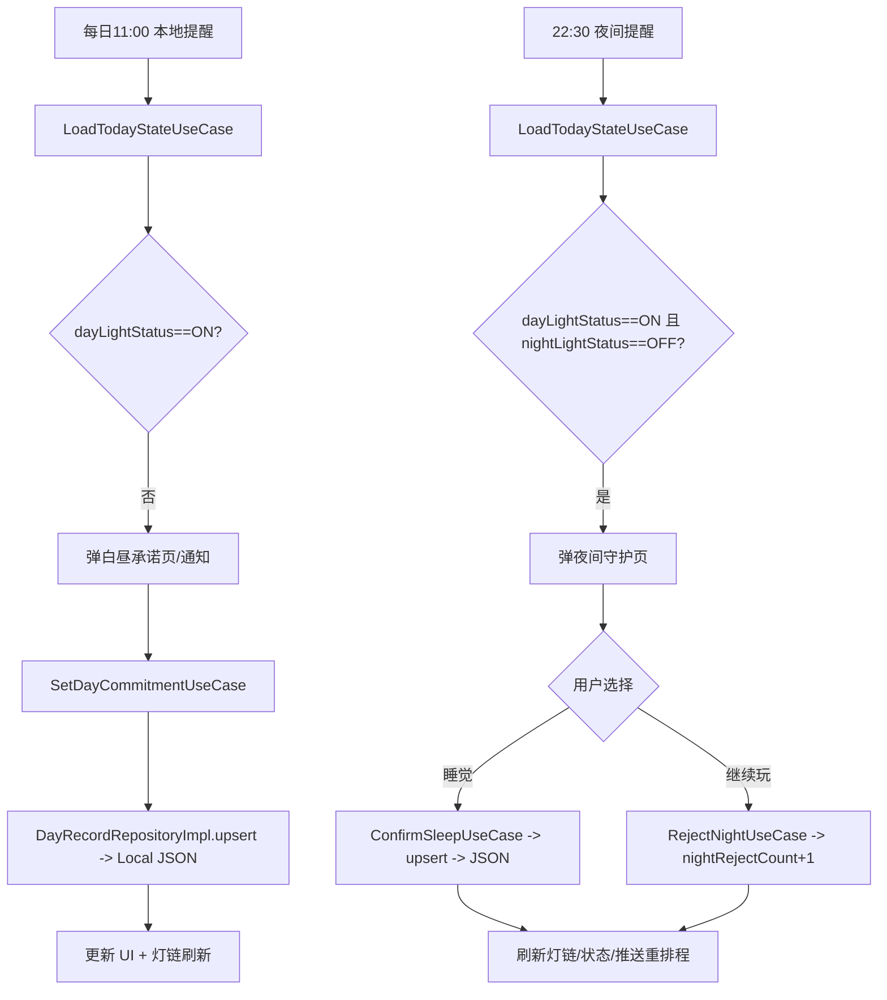

# Daylight PRD（MVP 存档）

> 约束：当前 SwiftUI 已实现的三个页面（入口/白昼承诺/夜间守护）视觉效果需保持，仅在此基础上补强文案、提醒节奏与交互细节。

## 核心目标（Mission）
用日夜双灯机制，帮助 18–35 岁报复性熬夜者在不增加焦虑的前提下戒掉熬夜冲动。

## 用户画像（Persona）
- 报复性熬夜者（上班族+学生），白天被挤压，夜晚补偿性刷手机。
- 需要简单、温和、无数据压力的“自我守护”工具；对隐私敏感。
- 中英双语用户，讨厌轰炸式提醒；手机依赖强，iPhone 首发。

## V1: 最小可行产品（MVP）
- 白昼承诺：11:00 默认提醒；一句话承诺 1–80 字；内置 8 条推荐理由；点亮白昼灯。
- 夜间守护：22:30–00:30 窗口，两次本地提醒（默认 30 分钟间隔）；仅当日白昼灯 ON 才弹；“睡觉”点亮夜间灯，“继续玩”计数。
- 灯链：展示 7–14 天双灯状态；点击看承诺与睡觉时间；断档不惩罚。
- 设置：可调提醒时间/夜间开关；完全离线存储；双语文案。
- 本地推送：仅本地通知；权限拒绝时前台弹窗兜底。
- 数据：匿名本地用户，JSON 存储 DayRecord/Settings，schemaVersion 预留，pending sync stub 保留但默认不上传。

## 当前实现进度（代码自查）
- 已对齐：SwiftUI 入口/白昼承诺/夜间守护页面视觉与灯链/设置页；本地化（en/zh-Hans）与语言切换、昵称配置已接通。
- 已落地核心用例：LoadTodayState/SetDayCommitment/ConfirmSleep/RejectNight/LoadLightChain/GetStreak/LoadMonth，按切日规则写入本地 JSON（DayRecord/Settings/User，Keychain 存 deviceId），缺失日期生成占位记录并计算 streak；PendingSync stub 仅入队不上传。
- 提醒：NotificationScheduler 排程 11:00 白昼提醒、夜间窗口内两次提醒（默认 30 分钟间隔，需 dayLightStatus==ON & nightLightStatus==OFF），支持承诺预览/昵称；前台通知 delegate 做 deeplink 导航。
- UI 交互：白昼承诺页 1–80 字校验，夜间守护页“睡觉”点亮夜灯/“继续玩”计数，灯链支持 14 天展示+月视图细节（可读取 docs/mock-sync-data.json 作为模拟数据），设置页实时保存提醒时间/间隔/夜间开关/是否在通知显示承诺。
- 差距/风险：通知权限被拒暂无前台兜底弹窗；夜间守护窗口校验仅在 UI 层（用例未限制，开发入口可绕过）；内置 8 条推荐理由仅保留常量，页面只露出 3 条；待同步队列仅写入本地无上传/重试（符合“默认不上传”，但无出站逻辑）。

## V2 及以后版本（Future Releases）
- V2：AI 个性化文案（白昼理由/夜间劝阻）；主题/灯光皮肤（浅/深、品牌化）。
- V2.5：iCloud/云备份（可选）、多设备同步；提醒智能节奏（基于历史拒绝/完成次数）。
- V3：Android 版本；周/月报告（不焦虑版）；会员权益（主题包/高级文案）。
- V4：轻社区/分享（不排名）；情绪化内容库；行为分析与 FeatureGate。

## 关键业务逻辑（Business Rules）
- 切日规则：22:30–23:59 归当日；00:00–00:30 归前一日；时间戳存 ISO8601 UTC。
- 白昼承诺：无记录则创建；空/超长拒绝；成功写入 `dayLightStatus=ON`、`updatedAt=now`。
- 夜间守护：仅当 `dayLightStatus=ON && nightLightStatus=OFF && 夜间窗口内`；两次提醒上限；“睡觉”→ `nightLightStatus=ON`、`sleepConfirmedAt=now`；“继续玩”→ `nightRejectCount += 1`。
- 灯链显示：缺失日期生成占位 `DayRecord(OFF/OFF)`；展示连续点亮天数但断档不清零、不惩罚。

## 数据契约（Data Contract）
- `DayRecord`: `{ userId, date(YYYY-MM-DD), commitmentText?, dayLightStatus:ON/OFF, nightLightStatus:ON/OFF, sleepConfirmedAt?:Date, nightRejectCount:Int, updatedAt:Date, version:Int, schemaVersion=1 }`
- `Settings`: `{ userId, dayReminderTime:"HH:mm", nightReminderStart:"HH:mm", nightReminderEnd:"HH:mm", nightReminderInterval:Int(默认30), nightReminderEnabled:Bool, version:Int, schemaVersion=1 }`
- `Pending Sync (stub)`: `{ pending:[{ type:"day_record", payload:DayRecord, retry_count, last_try_at }] }`
- 本地化：`en` / `zh-Hans` 两套文案，UI 结构一致，避免截断。

## MVP 原型设计与确认
选定方案：**原型 1 极简疗愈版**（与现有页面的光晕/极简布局一致，保持现有 UI 视觉）。

参考 ASCII：
```
[ 背景渐变 · 太阳光晕 ]
        ( ◉ )
  "白天的你守护夜晚的你"
  [ 点亮白昼之灯 ]
  ······灯链: o o ● o ○ ○ ···
```

其他备选（存档，暂不实现）：
```
2) 情绪便签版
╭──── 今日承诺 ────╮
│  写一句给今晚的你 │
│  [ ____________ ] │
│  推荐: ①明天醒来不会讨厌自己… │
╰───── 点亮白昼之灯 ──╯
夜间守护: 22:30, 23:00 轻提醒
灯链: [◎◎][◎○][○○][--占位--]

3) 仪式感圆盘版
     ☼ Day Lamp  (ON/OFF)
     ☾ Night Lamp(ON/OFF)
[承诺输入框][推荐理由按钮×3]
[点亮按钮]   [继续玩? 记录拒绝]
灯链条: ◉◉  ◉○  ○○  --  --  --
```

## 架构设计蓝图
### 核心流程（Mermaid）


### 组件交互说明
- Presentation：`TodayView` / `DayCommitmentPage` / `NightGuardPage`（保持现有视觉），绑定 `TodayViewModel`。
- Domain UseCases：`LoadTodayState`、`SetDayCommitment`、`ConfirmSleep`、`RejectNight`、`LoadLightChain`、`GetStreak`。
- Repositories：`DayRecordRepository`、`SettingsRepository`、`UserRepository`、`SyncQueueRepository`（stub）；全部经 `DayRecordRepositoryImpl` 等组合 Local + Remote stub。
- Data：`DayRecordLocalDataSource`、`SettingsLocalDataSource`、`UserLocalDataSource`、`PendingSyncLocalDataSource`、`RemoteAPIStub`。
- Core：`DaylightDateHelper`（切日/时区）、`NotificationScheduler`（本地提醒排程）。

### 技术选型与风险
- 技术：SwiftUI + MVVM；本地 JSON + Keychain；本地通知；无账号/无远端。
- 风险与对策：
  - 通知权限被拒：进入 App 时前台弹窗兜底。
  - 夜间跨日：统一用 `DaylightDateHelper`；重点测试 22:30–00:30 与 DST。
  - 数据损坏：`schemaVersion` + 迁移钩子，写入用原子文件/备份。
  - 文案长度：双语适配，避免按钮/灯链溢出。
  - 动效性能：光晕/模糊可在低端机降级（减少 blur 或使用 drawingGroup）。

## 最终确认
- 路线图与原型已锁定为“极简疗愈版”；保持现有 UI 的光晕与布局，仅微调文案/提醒次数/数据规则即可。后续若需调整，请在该文档迭代版本上更新。
