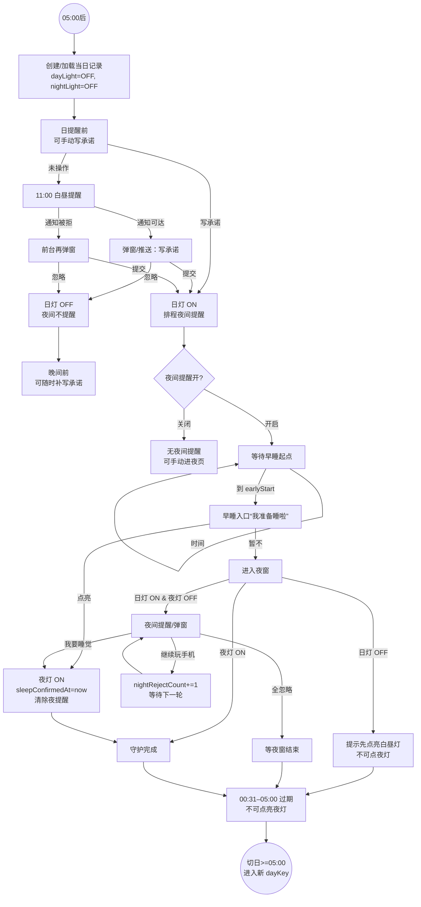
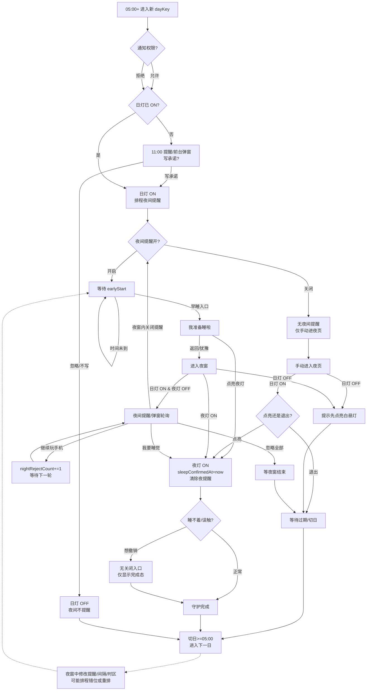

# Daylight 核心用户旅程穷举（MVP）

## 范围与依据
- 功能：白昼承诺（点亮日灯）/夜间守护（点亮夜灯或记录拒绝）/灯链呈现。
- 规则来源：`docs/feature-spec-daylight-core.md`、`docs/Prd.md`、`Daylight/Domain/UseCases/DaylightUseCases.swift`、`Daylight/Core/Utils/DateHelper.swift`。

## 关键时间与状态
- 日界与 dayKey：夜窗跨日，`22:30–23:59` 归当日，`00:00–00:30` 仍归前一日；绝对截止 `cutoff=次日05:00`。
- 早睡起点 `earlyStart = max(dayReminder+6h, 17:00)`；夜窗 `[nightReminderStart, nightReminderEnd]` 默认 `22:30–00:30`；夜间提醒间隔默认 `30` 分钟（最多 4 次）。
- 白昼提醒时间：默认 `11:00`。
- 核心状态：`dayLightStatus`（ON/OFF），`nightLightStatus`（ON/OFF），`nightReminderEnabled`（Bool），`nightRejectCount`，通知权限（系统层）。

## 分时段用户旅程穷举
### 1) 05:00–白昼提醒前
- 新日初始化：根据夜窗计算 dayKey，若无记录则创建默认记录（两灯 OFF）。
- 用户行为：
  - 主动写承诺 → 日灯 ON，排程夜间提醒。
  - 什么也不做 → 保持 OFF，等待日提醒。

### 2) 白昼提醒触达（默认 11:00）
- 前置条件：日灯 OFF。
- 通知权限已开：收到推送，点开/前台弹窗可输入承诺。
- 通知被拒：无推送；用户回到前台时，若日灯仍 OFF，弹窗提醒。
- 用户选择：
  - 写承诺提交 → 文案落库，日灯 ON，夜间提醒排程。
  - 忽略/关闭弹窗 → 日灯 OFF，夜间不提醒；可后续再补写。

### 3) 提醒后到早睡窗口
- 若日灯 ON：等待夜间；可修改/补充承诺；可关闭夜间提醒开关（关闭后无夜间提醒，但可手动进入夜页）。
- 若日灯 OFF：可随时补写承诺；否则夜间守护无法开始。

### 4) 早睡窗口（`earlyStart` 至夜窗开始，日灯必须 ON，夜灯 OFF）
- 首页 CTA：“我准备睡啦”。
- 用户行为：
  - 点亮夜灯（早睡）→ 夜灯 ON，记录 `sleepConfirmedAt`，清除当晚夜间提醒。
  - 暂不/返回 → 进入夜窗或等待。

### 5) 夜窗内（默认 22:30–00:30）
- 前置：`nightReminderEnabled=true` 且日灯 ON 且夜灯 OFF。
- 通知路径：按间隔最多 4 轮推送；无权限则前台弹窗。
- 用户选择：
  - “我要睡觉啦” → 夜灯 ON，记录 `sleepConfirmedAt`，清除后续夜间提醒。
  - “继续玩手机” → `nightRejectCount += 1`，夜灯仍 OFF，可被后续提醒。
  - 忽略全部提醒 → 夜灯 OFF，直到窗口结束。
- 若日灯 OFF：夜页提示“先点亮白昼之灯”，无法点夜灯。

### 6) 过期窗口（00:31–05:00）
- 夜灯 OFF：夜页显示“守护已结束/调整提醒时间”，不可再点亮夜灯。
- 夜灯 ON：显示完成态，无关提醒。
- 夜间提醒均停止，等待切日。

### 7) 切日后（≥05:00）
- 进入新 dayKey；灯链展示昨日结果：
  - 双灯亮：坚持成功。
  - 仅日灯亮：夜间缺失。
  - 两灯灭：未承诺。
- 新一日重复上述流程。

### 8) 灯链与补录场景
- 灯链读取 7–14 天历史；缺失记录以占位显示 OFF。
- 用户点击历史日：
  - 若夜灯已亮：展示睡觉时间、拒绝次数。
  - 若夜灯未亮：仅展示承诺/占位；无“补点亮”能力。

## 全流程图（覆盖所有分支）

## 备注与潜在缺口
- 夜灯不可撤销：早睡/误触后无关闭或回滚入口，失眠时仍显示完成态；夜灯应支持撤销
- 通知权限关闭：后台错过白昼/夜间提醒，前台才弹窗；恢复权限后的策略需明确：  
  如果希望尽量帮助用户补上当日行为（尤其白昼承诺），可以考虑在权限恢复后的首次前台时做一次“提醒状态检查”：
  若当前仍在白昼提醒窗口后/夜窗前，且日灯 OFF，可即时弹一次承诺弹窗。
  若当前仍在夜窗内，日灯 ON 且夜灯 OFF，可即时弹夜间守护。
  若已过夜窗或切日，不补发，仅提示“提醒已重新开启”。
- 夜间提醒开关：`nightReminderEnabled=false` 时无提醒但可手动点亮；用户在夜窗内关闭开关时，是否清理已排程提醒及是否展示确认文案当前不明确。建议：关闭时立即清除当晚排程，并弹出“今晚不再提醒，可在设置重新开启”，避免误解。
- 夜窗中调整设置：夜窗期间修改夜窗时间/间隔可能让已排程的提醒时间失真（错位或重复）；最佳实践是立刻重排当晚剩余提醒并告知“已按新时间更新”，否则用户以为已生效但实际上按旧时间提醒。
- 时间/时区/12h 切换：跨区或切换 12/24h 后，dayKey 归属和提醒时间可能与用户预期偏移；应监测系统时区/制式变更，自动重算 dayKey/排程，并在首页或设置提示“时区已变化，请确认提醒时间”。
- 多次拒绝后的反馈：`nightRejectCount` 仅计数，不影响提醒频率/文案；可考虑在拒绝多次后降频（避免打扰）、更换鼓励文案，或次日提供温和反馈/提示。
- 白昼缺失引导：日灯 OFF 进入夜页（如从夜间通知跳入）时，当前文案提示“先点亮白昼灯”，夜页也有“回首页”按钮，首页主 CTA 即“写承诺”，所以基本可达；若希望更直接，可在夜页增加“去写承诺”按钮或直接唤起承诺弹窗，减少一次跳转。
- 设备时间异常：用户手动改时间可能导致夜窗提前或过期；应检测显著时间跳变，提示“系统时间已变更，提醒已重新计算”，必要时限制在异常时间下的点灯操作以避免脏数据。

## 用户旅程全景图（含权限/设置/异常支路）

